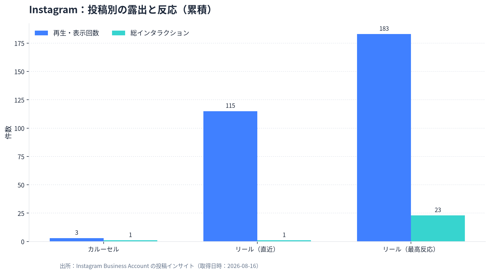
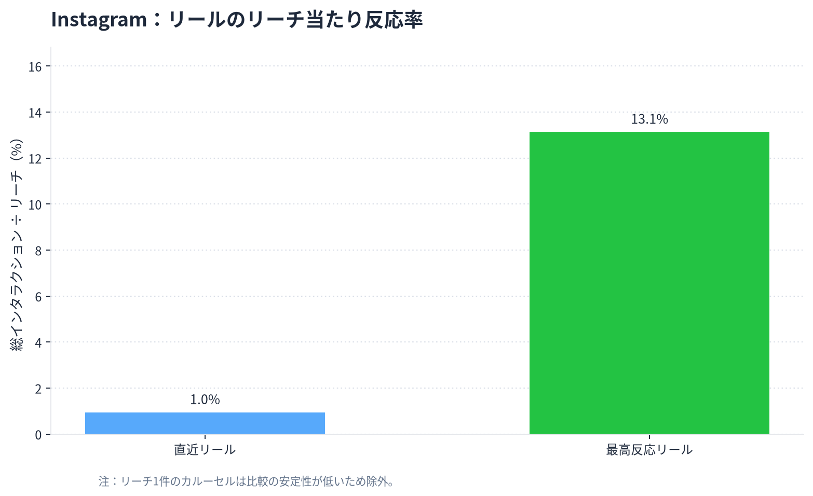

# Instagramフル分析レポート

**対象アカウント:** [@runa_girl8215](https://www.instagram.com/runa_girl8215/)  
**分析基準日:** 2026-08-16  
**データ範囲:** 接続済みInstagram Business Accountのアカウント概要・公開投稿3件・投稿インサイト

## エグゼクティブサマリー

取得時点でアカウントは投稿3件、フォロワー数はAPI応答上0件でした。投稿合計では、リーチ**281**、再生・表示**301**、総インタラクション**25**を記録しています。最高反応のリールは2026年4月6日投稿で、リーチ175、再生183、総インタラクション23（リーチ当たり**13.1%**）でした。

小標本のため結論は暫定的ですが、リールは2本合計で再生298・総インタラクション24となり、カルーセルの再生3・総インタラクション1を大きく上回りました。特に、いいね19・保存2・シェア1を得た最高反応リールは、単なる表示よりも再閲覧や共有につながる可能性を示します。今後はこの動画の音楽テーマ、サムネイル、公開時間、説明文を再現可能な形で記録し、同条件のリールで検証します。

| 指標 | 値 | 算出・注記 |
|---|---:|---|
| フォロワー数 | 0 | API返却値。異常または初期状態の可能性があるため、フォロワー基準ERは不使用 |
| 投稿数 | 3 | アカウント累計 |
| 合計リーチ | 281 | 投稿3件の累計 |
| 合計再生・表示 | 301 | 投稿3件の累計 |
| 合計総インタラクション | 25 | 投稿インサイトの累計 |
| リーチ当たり反応率 | 8.9% | 参考値。フォロワー基準ではない |

## 投稿パフォーマンス

*図1. 各画像は個別PNGとして保存しています。最高反応リールは、リーチ・再生・反応のすべてで主要な貢献をしています。*

*図2. リーチが1件のカルーセルは比率が不安定なため、リール同士で比較しています。*

| 投稿形式 | 公開日（UTC） | リーチ | 再生・表示 | 総反応 | リーチ当たり反応率 | 主な内訳 |
|---|---|---:|---:|---:|---:|---|
| カルーセル | 2026-05-31 | 1 | 3 | 1 | 100.0%* | いいね0、保存0、シェア0 |
| リール | 2026-05-30 | 105 | 115 | 1 | 1.0% | いいね1、保存0、シェア0 |
| リール | 2026-04-06 | 175 | 183 | 23 | 13.1% | いいね19、保存2、シェア1 |

> * リーチが極端に小さいため、カルーセルの比率は実務上の比較対象から除外します。

## 分析上の示唆

最高反応リールは、直近リールと比べてリーチが1.7倍、再生が1.6倍、総反応が23倍でした。現時点ではキャプション情報が欠けるため因果は断定できませんが、次回からはコンテンツテーマ、使用音源、尺、冒頭3秒、CTA、投稿時間をデータに追加し、保存・共有を優先KPIとして検証することが重要です。

> **実測値と推測の区別:** 上記の件数は実測値です。一方で「何が反応を生んだか」は現データだけでは確定できないため、仮説として扱います。

## 制約と次回更新での追加項目

アカウント集計値は取得時点の累積値であり、日次推移、ストーリーズ、フォロワー増減、広告寄与は含みません。フォロワー数が0と返却されている点も含め、今後は公式APIからの継続収集および日次スナップショットを行います。

## 参照

[1]: https://www.instagram.com/runa_girl8215/ "Instagramプロフィール"
[2]: https://developers.facebook.com/docs/instagram-platform/instagram-graph-api/reference/ig-media/insights "Instagram Graph API：メディアインサイト"
