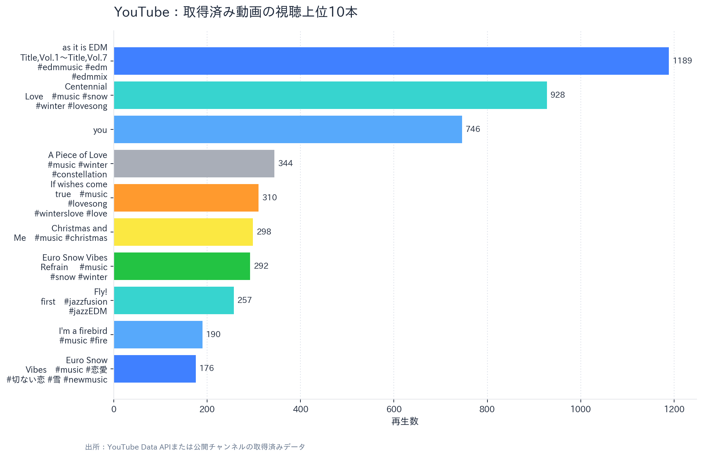
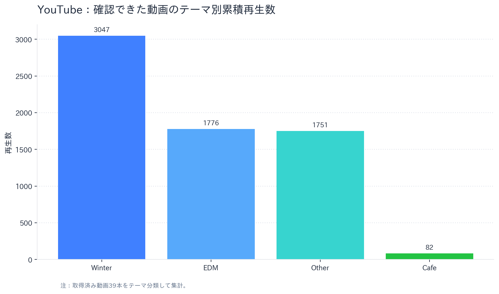

# YouTubeフル分析レポート（公開データ版）

**対象チャンネル:** [@@runa-girl8215](https://www.youtube.com/channel/UCHmI-5eV-xPLSVtcO8QOd7A)  
**分析基準日:** 2026-08-19T22:25:49+00:00  
**データ範囲:** YouTube Data API public channel statistics via API key。取得済み動画39本（公開動画数39本）

## エグゼクティブサマリー

チャンネルの公開統計では、登録者数は**85**、公開動画数は**39**です。取得済み動画39本（公開動画数39本）の累計再生数は**6,641**であり、上位3本（「as it is EDM  Title,Vol.1～Title,Vol.7  #edmmusic #edm #edmmix」「Centennial Love　#music #snow #winter #lovesong」「you」）が**2,863**再生を占めました。これは取得対象の累計再生の**43.1%**に相当し、視聴が一部タイトルに集中していることを示します。

一方で、チャンネル説明が掲げるCafé Seriesの直近2本は、公開表示上それぞれ63回・13回でした。これだけでシリーズの将来性を判断することはできませんが、既存の高再生群がEDM・冬季テーマ・長尺コンピレーションを含むため、Café Seriesは一貫したサムネイル、タイトル語彙、再生リスト、短尺誘導を組み合わせ、独立した視聴導線として育てる余地があります。

| 指標 | 値 | 注記 |
|---|---:|---|
| 登録者数 | 85 | 公開統計 |
| 公開動画数 | 39 | 公開統計 |
| 取得動画数 | 39 | YouTube Data API public channel statistics via API key |
| 取得動画の累計再生数 | 6,641 | 同上 |
| 視聴上位3本の累計再生数 | 2,863 | 観測対象に対する比率は43.1% |
| Café Series確認動画 | 2 | 直近の公開動画2本 |

## 視聴パフォーマンス

*図1. 各画像は個別PNGとして保存しています。取得済み動画のうち、視聴上位10本を示します。*

*図2. 取得済み動画39本をテーマ分類した累積再生数です。*

| 順位 | 動画 | 公開表示の再生数 | テーマ |
|---:|---|---:|---|
| 1 | [as it is EDM  Title,Vol.1～Title,Vol.7  #edmmusic #edm #edmmix](https://www.youtube.com/watch?v=GUc3fZU9luE) | 1,189 | edm |
| 2 | [Centennial Love　#music #snow #winter #lovesong](https://www.youtube.com/watch?v=W8J6ksdA-Xc) | 928 | winter |
| 3 | [you](https://www.youtube.com/watch?v=Vl-Ufwce0XQ) | 746 | other |
| 4 | [A Piece of Love   #music #winter #constellation](https://www.youtube.com/watch?v=hKi5pSwU_Cs) | 344 | winter |
| 5 | [If wishes come true　#music #lovesong #winterslove #love](https://www.youtube.com/watch?v=BALaupsyad4) | 309 | winter |
| 6 | [Christmas and Me　#music #christmas](https://www.youtube.com/watch?v=LOtXLDSyvbQ) | 298 | winter |
| 7 | [Euro Snow Vibes  Refrain     #music #snow #winter](https://www.youtube.com/watch?v=sUJF5Jg6A1E) | 292 | winter |
| 8 | [Fly! first　#jazzfusion #jazzEDM](https://www.youtube.com/watch?v=y7uqHSYFcg4) | 257 | edm |
| 9 | [I'm a firebird #music #fire](https://www.youtube.com/watch?v=OU-E8lf840E) | 189 | other |
| 10 | [Euro Snow Vibes　#music #恋愛 #切ない恋 #雪 #newmusic](https://www.youtube.com/watch?v=8snFp0oDL_c) | 174 | winter |

## 分析上の示唆

公開データの範囲では、上位コンテンツは季節・感情・ジャンルを明示したタイトルと、複数曲をまとめた長尺作品に偏っています。Café Seriesはチャンネルの説明文と直接整合するため、今後はタイトルの先頭に用途語（例：focus、reading、work）を置き、同じシリーズ名・視覚ルール・再生リストを固定し、長尺版からShorts／Instagram Reels／TikTokへの導線を一本化することが検証可能な仮説です。

> **実測値と推測の区別:** 再生数・登録者数は公開表示の実測値です。CTR、視聴者維持率、流入元、収益、視聴者属性は未取得であり、上記の打ち手は仮説です。

## 制約と次回更新での追加項目

本レポートはYouTube Data APIで取得できる公開統計を対象にしています。YouTube Analytics APIの認可後は、日次の視聴回数、総再生時間、平均視聴時間、インプレッションCTR、登録者増減、トラフィックソース、視聴者維持率を追加し、公開データ版を所有者分析版へ更新します。

## 参照

[1]: https://www.youtube.com/channel/UCHmI-5eV-xPLSVtcO8QOd7A "YouTubeチャンネル"
[2]: https://developers.google.com/youtube/analytics/reference/reports/query "YouTube Analytics API：reports.query"
[3]: https://developers.google.com/youtube/v3/docs/channels "YouTube Data API：channels"
