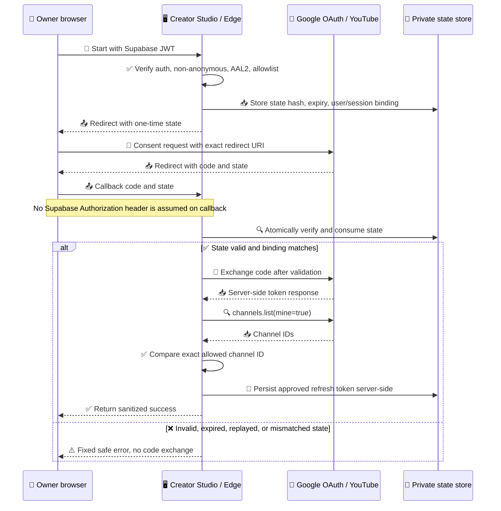

# YouTube Creator Studio Phase 3-B0 Implementation Baseline

_設計確認用の基準書 — FieldRise YouTube Creator Studio / 2026-09-27 JST / 実装・適用前_

---

## 📋 目的と停止条件

本書は、Phase 3-B実装前に、Git source-of-truth、OAuth callback hardening、upload state machine、forward-only DB migration、RPC境界をレビュー可能な形で固定するための**設計案**である。Phase 3-A正式設計書と彩花CTOの引継ぎ指示を基礎にし、このセッションで確認できたGit mainとGoogle公式資料だけを根拠にする。

> **重要:** Supabase connector OAuth failureにより今回のlive再確認はBLOCKED（MCPが`token request failed with status 422: Required parameter: client_secret`を返した）。これはSupabase Function自体の障害を意味しない。client_secretやその他Secretの手動入力・共有を求めず、同じOAuthを再試行しない。過去の版数・live/Git比較結果は過去の報告としてのみ記載し、今回確認済みとは扱わない。

今回の実施範囲はGit/公式資料の読み取りと本設計書のローカル作成のみ。Function source、DB、RPC、Secret、Auth、OAuth設定、scope、Deploy、実upload、投稿ボタン、Commit、Pushは変更・実行しない。**本書の作成はPhase 3-B実装GOではない。**

## 🔍 確認済みの基準点

| 項目 | 今回確認した事実 |
|---|---|
| Repository / branch | `FieldRiseJapan/FieldRise` / `main` |
| 同期後のHEAD | `2dbc22101372d84b56481a3ef682d04110c6a878` |
| Git状態 | 調査開始時は`main...origin/main`でclean。設計書作成後は本ファイルだけが未追跡になる想定 |
| Phase 3-A | `docs/momoka/designs/youtube_secure_upload_integration_phase3a.md`が存在。指定Commit `9963a1f517e242fabe523abceb71c6ff84ca2119`が存在 |
| Phase 3-B0候補 | `docs/momoka/designs/youtube_phase3b0_implementation_baseline.md`は開始時に存在せず、本セッションで再構成 |
| Git管理されたGateway | `supabase/functions/youtube-upload-gateway/index.ts`、`handler.mjs`、`policy.mjs`、`schema.sql`、`README.md`等を確認 |
| Git管理された旧Function | `supabase/functions/youtube-upload/index.ts`と`supabase/functions/youtube-oauth-callback/index.ts`は追跡対象に存在しない |
| Gateway JWT設定 | Gitの`supabase/config.toml`に`[functions.youtube-upload-gateway] verify_jwt = true`を確認。これはGit設定であり、live設定確認ではない |
| Draft DB schema | GitのGateway `schema.sql`には`youtube_gateway_private.attempts`とreserve/finish RPC案がある。READMEはSQL未適用と記載。live DBへの適用状態は今回確認できない |
| Supabase live | **BLOCKED** — Connector OAuth failure。Function/DBの稼働状態やソース障害とは判定しない |

Phase 3-Aは、認証済みGatewayからserver-side shared upload moduleを呼ぶA案、Gateway経路で`YOUTUBE_UPLOAD_SECRET`を使わないこと、ブラウザーへtoken/Secretを渡さないこと、callback/state/channel bindingとidempotencyが実upload前の必須条件であることを承認済み設計としている。詳細は[Phase 3-A正式設計書](./youtube_secure_upload_integration_phase3a.md)を参照。

## 🧭 Source-of-truthとlive差異の扱い

### 今回のlive確認状態

| Function | 過去の引継ぎにある版数 | Phase 3-A文書の2026-09-26記録 | 今回のlive版数/source確認 |
|---|---:|---:|---|
| `youtube-upload` | v7 | v7 | **BLOCKED** |
| `youtube-oauth-callback` | v8 | v8 | **BLOCKED** |
| `youtube-upload-gateway` | v5 | v4 | **BLOCKED** |

上表の版数はそれぞれ過去の資料に書かれた**前回確認済み情報**であり、今回の再確認値ではない。Gatewayは過去の引継ぎ(v5)とPhase 3-A記録(v4)が食い違うため、現在の版数を推定しない。Live/Git source comparisonは、live sourceを読めなかったため全対象について**BLOCKED**。旧upload/callbackはGit sourceも存在しないため、liveとの比較材料もない。

前回引継ぎの「GatewayはGit mainの3ファイルと一致」「Gateway `verify_jwt=true`」および「upload/callbackはlive sourceのみ確認、対応するGit sourceがなく比較不能」という記録も、今回は再確認できていない**前回報告**である。Gatewayの今回確認可能な事実は、GitにあるGateway filesと`supabase/config.toml`の`verify_jwt=true`のみ。liveとの一致/差異は全Functionで**BLOCKED**。今回、前回報告とのlive差異の有無を判定できない。

### 正式な運用モデル

1. `main`を将来のFunction source-of-truthとして扱う。Supabase Dashboard上だけのlive sourceを正本にしない。
2. 変更前にlive設定・version/source hash・Secret名（値は取得しない）を読み取り、Gitとの差異を説明可能にする。live確認できなければ改修・Deploy対象を確定しない。
3. Git mainのreview → mock test/静的検証 → 彩花CTO／社長の明示承認 → 対象と差分を再確認 → 必要なものだけDeploy、の順序を守る。
4. Gitにない旧Functionを将来変更する必要が生じた場合は、承認済みの読み取り手段で現行sourceを安全に取得し、秘密値を除外してGitへレビュー可能な形で同期する。その前に推測で再実装・置換・Deployしない。
5. GatewayのGit `verify_jwt=true`は保持する設計前提。ただし設定ファイルの存在だけでliveも同値と結論しない。

本タスクの状態: **Git基準は確認済み、source-of-truth方針は確認済み、live比較はBLOCKED、Deploy/Commit/Pushなし**。

## 🔐 OAuth callback hardening

### 信頼境界

Supabase Authorization header/JWTはOAuth Start requestでだけ受信する前提とし、Start endpointでJWTを正式検証した後に限りtransactionを作成する。確認順は`authenticated` → non-anonymous → AAL2 → single-user allowlist。検証後にstate hashとStart時に検証済みのuser/session bindingを保存してからGoogleへredirectする。

Googleから戻るcallbackは`code`と`state`だけを受け取るものとして設計し、Supabase Authorization headerやJWTが自動で付くと仮定しない。callbackの認証根拠はStart時に検証されtransactionへ結びつけたuser/session bindingとし、callbackで現在のAAL2を直接確認できるとは断定しない。

### 必須フロー

1. OAuth StartはCreator Studioからのrequestに付くSupabase Auth JWTを正式検証し、`authenticated`、non-anonymous、AAL2、single-user allowlistをこの順に確認する。いずれか失敗したらtransactionを作らず終了する。
2. 検証成功後、CSPRNGで最低256-bit相当のone-time `state`を生成する。server-sideには`SHA-256(state)`だけを保存し、平文stateはGoogle redirectに一度だけ用いる。推奨初期TTLは10分（実装時に調整・承認）とする。
3. Server-side transactionはstate hash、内部Auth user ID、Start時に検証済みのsession binding（session ID等）、発行/expiry時刻、requested scope set、consumed状態のみを保持する。JWT、Google code/token、email、TOTP情報は保存しない。
4. Start endpointはtransaction作成後にのみGoogle OAuthへredirectする。transaction作成に失敗した場合はredirectしない。
5. Callbackは`code`またはGoogleの`error`と`state`を受け取る。token endpointへ接続する前にstate hashでtransactionを照合し、expiry、未消費、Start時に検証したuser/session bindingとの一致を検証する。callback requestにSupabase JWT/headerがある前提は置かない。
6. callbackで現在のAAL2を再確認する方式を採る場合は、callbackで利用可能な安全な再認証/session証明手段をPhase 3-B実装前に確定する。手段が未確定の現段階では「callbackで現時点のAAL2を直接再確認できる」と断定せず、Start時にAAL2/allowlist確認済みのtransaction bindingを基本の信頼根拠とする。どちらの方式を実装採用するかは着手前の未解決事項とする。
7. state/bindingの検証後にone-time consumeを1 transaction内で原子的に完了してから、初めてauthorization codeを一度交換する。不一致・期限切れ・消費済み・binding不一致ならcode交換もtoken保存も行わない。並行callbackでは一方だけがconsumeに成功する。
8. 固定した完全一致`redirect_uri`を使い、client credentialとtokenはserver-sideに限定する。redirect URI mismatch、Google error、timeout等を固定のsafe error codeへ変換する。
9. 取得tokenが期待scopeを満たすか確認し、channel identityのserver-side検証に成功した後だけrefresh tokenを保存する。既存tokenを更新する場合は旧tokenを不用意に上書きせず、別途承認済みのrollback/rotation手順を用意する。
10. Query stringの`code`/`state`、Authorization header、token response/raw bodyをapplication log、analytics、error report、browser UIへ出さない。Callback URL/redirect設計はquery値を転送・反射せず、不要な履歴を速やかに除去する。Access log上のquery redactionを実装環境でテストする。

Googleは`state`をCSRF等への対策に有用な値として説明し、authorization codeはcallback後にtokenへ交換するweb-server flowを定義している。また、redirect URIはOAuth clientに登録したURIと完全一致させる必要がある。[^3] state hash化、one-time consume、Auth/session binding、AAL2/allowlist再検証は本システムに対する設計要件である。

### Callback sequence

この図は提案フローであり、現在のcallback実装の確認結果ではない。callbackで再認証してAAL2を確認する方式を採るか、Start時検証済みtransaction bindingをcallbackの認証根拠として採用するか、OAuth開始endpoint/session bindingの実配置、access log query redactionはPhase 3-B着手前に決定する。

## 🎯 Channel identityとOAuth scope判断

Googleの公式YouTube API discovery metadataでは、`videos.insert`が受け付けるscopeに`youtube.upload`が含まれる一方、`channels.list`のscope一覧に`youtube.upload`は含まれない。`channels.list`は`youtube.readonly`、`youtube.force-ssl`、`youtube`等を受け付ける。[^1] `channels.list(mine=true)`は認証ユーザーが所有するchannelを返すとAPI referenceに記載されている。[^2]

| 問い | 設計判断 |
|---|---|
| `youtube.upload`だけでvideo upload可能か | **可能** — `videos.insert`の許可scopeとして公式discovery metadataに列挙される。[^1] |
| `youtube.upload`だけで`channels.list(mine=true)`を呼べるか | **前提にしない／scope一覧上不可** — `channels.list`の許可scope一覧に`youtube.upload`がない。[^1] |
| channel identityの確認手段 | OAuth access tokenで`channels.list(part=id, mine=true)`をserver-side呼出しし、返却channel IDをserver-side許可channel IDと完全一致で比較する。`title`、handle、emailだけで照合しない。[^2] |
| 追加scope候補 | 読み取り最小候補は`https://www.googleapis.com/auth/youtube.readonly`。これも`channels.list`で有効なscopeの一つ。`youtube`/`youtube.force-ssl`はより広い管理権限なので第一候補にしない。[^1] |
| 現在の変更 | **追加scope・Google consent・再認可は行わない。** 所有者/CTOの別判断まで現在のscope/credentialを変更しない。 |

`channels.list`で許可channel IDを得られない、複数候補が曖昧、または期待channelと不一致の場合はtokenを保存せずfail closedにする。`videos.insert`の成功応答で後からchannelを確認する方法は、誤channelへの投稿を未然に防げないためcallback時の事前verificationの代替にしない。OAuth flow/credentialが現在どのchannelに紐づいているかは、live token/APIを読めないため今回未確認。

## 🔁 Upload state machineとIdempotency

### 状態遷移

```mermaid
stateDiagram-v2
    accTitle: Upload Attempt State Machine
    accDescr: A validated attempt can be accepted, uploaded once, or blocked as outcome unknown; an unknown result is resolved only through human reconciliation.

    [*] --> accepted: 📥 Reserve unique key and fingerprint
    accepted --> uploading: 📤 Persist before provider request
    accepted --> failed: ❌ Expired or rejected before provider call
    uploading --> succeeded: ✅ Provider success and video ID confirmed
    uploading --> failed: ❌ Definitive proof no video was created
    uploading --> outcomeUnknown: ⚠️ Provider acceptance is ambiguous
    outcomeUnknown --> succeeded: 🔍 Human reconciliation confirms video
    outcomeUnknown --> failed: 🔍 Human reconciliation confirms no video
    succeeded --> [*]: 🏁 Terminal, no replay
    failed --> [*]: 🏁 Terminal, no same-key replay
    outcomeUnknown --> [*]: 🔒 Blocked until reconciliation
```

| State | 意味 / 許可する次の動作 |
|---|---|
| `accepted` | Auth/payload検証とkey reservation完了。YouTube requestをまだ開始していない。module呼出し前に必ずDBへ確定する |
| `uploading` | YouTube requestを開始し得る状態。provider送信後のtimeout、process crash、response消失、video ID欠落、DB success write失敗は`failed`ではなく`outcome_unknown` |
| `succeeded` | YouTube完了応答と非空video IDを確認し、DBにも成功を確定。動画はprivate固定。永久に再uploadしない |
| `failed` | providerに作成されなかったことが明確な失敗、または開始前の失敗。新しい投稿を許すかは既存attempt・rate limit・運用規則を確認して決定。同じkeyは再開しない |
| `outcome_unknown` | YouTubeに受理された可能性を否定できない。自動retry、新しいkeyでの同一内容投稿、stale rowの`failed`化を禁止。人が照合・記録するまでチャンネル単位で新規投稿をblock |

`uploading`のlease期限切れは安全な失敗の根拠ではない。次のstatus/reserve処理でexpired uploadingを`outcome_unknown`へ原子的に移し、以降のrequestを拒否する。`accepted`はmoduleを呼んでいないという不変条件を守り、期限切れでもprovider未呼出しを保証できる場合だけ`failed`にできる。Lease値はruntime測定後に決める。

### Idempotencyの規則

- Unique keyは`(user_id, idempotency_key)`。idempotency keyは高エントロピーUUIDとして扱い、ログに出さない。
- Payload fingerprintは、正規化済みmetadataと動画byte列のhashからserver-sideで算出する。動画本体は保存しない。
- same key + same fingerprint: 現在の状態を返す。**新しいYouTube upload request/sessionを開始しない。**
- same key + different fingerprint: `409`相当の`idempotency_conflict`。既存attemptは変更しない。
- `succeeded`, `failed`, `outcome_unknown`は同じkeyで再実行しない。Unknownは同一keyに限らず、解消まで新しいkeyのreserveもblockする。
- Expired `uploading`はunknown相当としてblockする。DBやEdge timeoutを再投稿許可の根拠にしない。
- reserveは1 transaction内で一人の許可user/channelについて直列化する。active attemptは最大1件とする案。Phase 1 draftにある3件/15分のrate limitは**候補値**として引き継ぎ、Phase 3運用値としてはOwner/CTOが承認するまで確定しない。

### Gateway uploadの順序

1. `verify_jwt=true`のGatewayがSupabase Auth JWTを正式検証し、authenticated、non-anonymous、AAL2、single-user allowlistを確認する。
2. Origin/method、multipart body、動画・metadataの上限/内容を検証する。Gatewayはvalidation_onlyを維持したまま既存2 MiB Phase 1制限を変えず、runtime/streaming上限は実測・承認まで拡大しない。
3. 安定したpayload fingerprintを算出し、reserve RPCを呼ぶ。Duplicateは既存stateを返し、moduleを呼ばない。
4. `accepted -> uploading`をDBで確定してからshared upload moduleを呼ぶ。ModuleにはJWT、browser request、callback処理を渡さず、Google credentialはserver-sideで取得・利用する。
5. YouTube metadataは`privacyStatus=private`、`notifySubscribers=false`を固定する。既存`categoryId=10`、`selfDeclaredMadeForKids=false`は未承認の製品判断として別レビューする。
6. Confirmed successはvideo ID検証後にDBを`succeeded`へ更新し、その後に最小限の成功応答を返す。完了response/IDが確認できない、またはDB確定できない場合はunknownに倒す。

## 🗃️ Forward-only DB migration案

今回Gitから読めたGateway `schema.sql`は`processing / validated / failed`を定義したPhase 1 draftであり、READMEは未適用と説明している。彩花CTOのレビュー指示では、実環境に`state = validated`のattemptが存在すると引き継がれている。今回のlive DB再確認はOAuth failureによりBLOCKEDのため本セッションでは独立に確認していないが、migrationではこの既存rowを必ず保持する前提を置く。実際の適用状態、constraint名、table/RPCの有無を推測しない。

将来のmigrationは、実装前のlive確認と以下の順序を満たすforward-only変更とする。既存rowの削除・再初期化・state自動変換は禁止する。

1. 適用前にlive schemaとmigration履歴を読み取り確認する。確認できない場合はmigrationしない。
2. 実際のstate CHECK constraint名と、constraintが許可するstate集合を確認する。
3. 既存rowのstateを秘密値を含まないstate別件数の集計で確認し、想定外stateがあれば適用を止めて扱いを決める。
4. `processing`、`validated`、`failed`等の既存legacy stateとrowを削除・変換せず保持する。
5. CHECK変更が必要な場合だけ、legacy states `processing`、`validated`、`failed`とPhase 3 states `accepted`、`uploading`、`succeeded`、`failed`、`outcome_unknown`の両方を許可するforward migrationとして変更する。Phase 3 statesだけのCHECKを先行適用しない。
6. 新規Phase 3 attemptを識別するimmutableなversion/type markerまたは同等の明示的な作成経路を設計し、新規attemptだけに新state machineを適用する。legacy rowをstate名だけで新attemptと解釈しない。
7. legacy `validated`を`succeeded`へ自動変換しない。
8. legacy rowにfingerprintがなく同一payloadと証明できない場合、idempotency keyの再利用を拒否する。
9. 既存rowを削除しない。
10. 適用後、row削除/変換がないこととstate別件数を秘密値を出さない集計形式で確認し、適用前後のrow count/state distributionを比較する。

| 列/制約案 | 用途・条件 |
|---|---|
| `user_id`, `idempotency_key` | 既存draftにあるkey。`(user_id, idempotency_key)` unique/primary keyを維持。実DBで確認してから変更 |
| `state` | 必要な場合のみ、legacy `processing`/`validated`/`failed`とPhase 3 `accepted`/`uploading`/`succeeded`/`failed`/`outcome_unknown`の和集合を許可するCHECKへforward migration。legacy値は保持し、新規Phase 3 attemptだけ新state machineへ入れる |
| `created_at`, `updated_at` | 既存`created_at`保持。追加`updated_at`はmigration時に値を補完し、全RPC更新で維持 |
| `payload_fingerprint` | 新attemptでは必須の32-byte SHA-256相当表現。旧行はnull可。動画contentは保存しない |
| `video_id` | `succeeded`確定時だけ保存。その他の状態ではnull。logs/一般APIへ露出しない |
| `safe_error_code` | allowlistされた固定codeのみ。Google raw body、例外message、個人情報は保存しない |
| `attempt_count` | 新attemptで初期化し、内部状態変化に合わせ更新。無制限の再試行カウンターに使わない |
| `lease_expires_at` | `accepted`/`uploading`回復判定。期限切れ`uploading`はunknownへ倒し、期限切れだけでfailedへ戻さない |
| 手動照合記録 | Unknown resolution actor/time/resultを監査可能にする。必要最小限のinternal actor referenceと固定resolution codeを別設計する。自由記述にtoken、email、動画内容を入れない |

適用前後の集計はrow countとstate別件数だけに限定し、user ID、idempotency key、video IDその他の秘密値を出さない。lock時間・既存行互換性・rollback/forward-fixもreviewし、実在constraintを確認してから変更する。

RLSを有効にしたprivate schema/tableとし、`public`/`anon`/`authenticated`からtable accessとRPC executeをrevokeする。RPCは`SECURITY INVOKER`、`SET search_path = ''`、qualified object referencesを基本とし、必要な最小権限だけ`service_role`へ付与する。`SECURITY DEFINER`によるRLS回避を安易に追加しない。ブラウザーからservice-role keyまたはRPCを直接使わせない。

## ⚙️ RPC contract案

RPCはすべてserver-side Gatewayからのみ呼び、検証済みJWTの`sub`だけを`user_id`へ渡す。DB側ではservice_role以外の直接実行を拒否し、user ID、key、fingerprint、video ID、error codeをログへ出さない。各RPCは1つのPostgres transaction内で行ロック/条件付きUPDATEを行い、想定外transitionではstateを変更せず固定結果codeを返す。

**DB/RPC-level invariant:** unresolved `outcome_unknown`、未解決の期限切れ`uploading`、またはproviderへ送信済みか否かを確定できないattemptが対象channelに1件でもあれば、そのchannelへの全ての新規reserveを拒否する。判定対象channelはserver-sideで特定する許可channelとし、callerが別channel/keyを渡してblockを回避できないようにする。人間のreconciliation後に`youtube_gateway_resolve_unknown`がterminal stateを確定した場合にだけblockを解除できる。

既存legacy rowについても、保存されたstateだけではprovider未送信を証明できない場合はprovider-outcome uncertaintyとして同じchannel blockの対象にする。legacy row自体は自動変換・削除せず、human reconciliation前提で保持する。

`reserve`、attempt transition、unknown resolutionは同一のchannel単位transaction/advisory lock policyを使う。`youtube_gateway_reserve`はそのlock内でstale/expired `uploading`を確認し、期限切れだけを理由に`failed`へ変更せず、provider outcomeが未確定なら原子的に`outcome_unknown`へ移して同じtransactionで拒否する。active `uploading`、unresolved `outcome_unknown`、その他provider結果不明のrowがある場合も、新keyの予約を拒否する。unknown確認、active attempt確認、idempotency確認、新規reserveを別々の非原子的処理に分けない。

| RPC | Input (candidate) | Atomic rule / allowed transition | Conflict behavior |
|---|---|---|---|
| `youtube_gateway_reserve` | `p_user_id`, `p_key`, `p_fingerprint` | Acquire the same transaction lock keyed by the server-derived canonical allowed channel; atomically check unresolved unknown/provider-uncertain rows, expired/active uploading, active attempt, idempotency, and rate limit; only then insert a new `accepted` row | Any unresolved `outcome_unknown`, expired uploading (first move atomically to unknown), active uploading, or provider-outcome uncertainty blocks every new key for that channel. Same key/same fingerprint returns existing state without upload; same key/different fingerprint conflicts. No provider call |
| `youtube_gateway_mark_uploading` | `p_user_id`, `p_key`, bounded lease duration | `accepted -> uploading`; lease and `updated_at` set atomically. Caller invokes provider only after a confirmed successful transition | Any other state returns stale/conflict; never starts another upload |
| `youtube_gateway_mark_succeeded` | `p_user_id`, `p_key`, validated nonempty `p_video_id` | `uploading -> succeeded`; store ID once; clear lease/error. Idempotent only when same row is already succeeded with same ID | Different ID or terminal non-success state conflicts; DB write failure is treated as ambiguous by caller |
| `youtube_gateway_mark_failed` | `p_user_id`, `p_key`, allowlisted `p_safe_error_code`, `p_no_video_created` evidence flag | `accepted -> failed`; `uploading -> failed` only when trusted module classifies provider response as definitive proof that no video was created | Ambiguous transport/provider outcome must use unknown, never this RPC |
| `youtube_gateway_mark_outcome_unknown` | `p_user_id`, `p_key`, fixed reason code | `uploading -> outcome_unknown`; can be idempotent for an already unknown row. Do not accept raw exception/body | Blocks all new channel uploads until manual resolution |
| `youtube_gateway_get_status` | `p_user_id`, `p_key` | Read-only status for exact user/key; no arbitrary user search | Not found returns generic not-found; expired uploading is presented/treated as requiring reconciliation, never retryable |
| `youtube_gateway_resolve_unknown` | `p_user_id`, `p_key`, resolution (`succeeded`/`failed`), optional verified video ID, fixed audit code | Human reconciliation only; acquire the same channel lock, require `outcome_unknown`, atomically update terminal state and append audit event | Idempotent only for same terminal result; conflicting second decision is rejected and escalated. Channel block is released only after this safe terminal resolution |

`p_no_video_created` is not independent proof: the Edge module is trusted to call `mark_failed` only on a definitive pre-creation outcome. If provider acceptance is uncertain, token refresh/init/PUT response is lost, process crashes during transfer, success JSON is invalid/missing an ID, or DB success write cannot be confirmed, transition to or retain `outcome_unknown` and stop.

Before implementation, finalize response codes, payload fingerprint canonicalization, rate/lease values, concurrent calls, grant verification, audit retention, and data retention. No SQL or RPC is created/applied in this phase.

## 🛡️ Secret boundaryと検証計画

Never persist or log video bytes, JWT, Supabase Auth user UUID values in logs, allowlist value, `YOUTUBE_UPLOAD_SECRET`, Supabase service-role key, Google client secret, Google access/refresh token, TOTP secret/code, personal email, raw Google response, or resumable `Location` URI. Keep allowed server-side IDs/credentials out of report output, client response, committed fixtures, and test artifacts. Resumable URI is bearer-equivalent; initial design keeps it memory-only and does not persist it.

Phase 3-Bで実装承認後に必要なmock tests:

- Auth tests: missing/invalid JWT, AAL1, anonymous, allowlist mismatch, callback user/session mismatch.
- OAuth tests: missing/malformed/expired/consumed state, altered state, concurrent replay, Google denial, scope deficiency, channel mismatch. Assert no code exchange before state checks and no token save before channel verification.
- Idempotency tests: same key/same and different fingerprint, concurrent reserves, existing legacy rows, rate limit, only one active upload, success terminality.
- Failure-injection tests: pre-provider failure, explicit provider rejection, timeout after request send, upload body interruption, response loss, malformed success response, DB write failure, stale lease. Ambiguous outcomes must become/behave as `outcome_unknown` and cannot trigger a new upload.
- Redaction tests: seed mock errors, provider body, request headers and logger with canary strings; assert no sensitive value appears in logs, errors, response or source fixtures.
- Regression: preserve validation_only behavior and existing Auth/Creator Studio/TikTok/Instagram boundaries. No test calls real Google/YouTube APIs.
- Before a separately approved real private upload test: close/tombstone the old direct upload route first; confirm only one posting path can create videos; keep post button disabled until separate approval.

## ⛔ Unresolved事項と次の承認gate

1. Supabase MCP OAuth connector repair through its authorized setup path; **do not ask for or accept manual client_secret/other Secret values**. Until resolved, live Functions, deployment config, DB schema, RPC existence, and exact live/Git diffs remain BLOCKED.
2. Resolve conflicting prior Gateway version notes (Phase 3-A v4 vs later handoff v5) through a future read-only live check. Do not assume either is current.
3. Confirm the supported callback/session-binding topology and query-string redaction from live platform logs before implementation.
4. Owner/CTO decides whether to request `youtube.readonly` in a future separately approved consent/re-authorization. This design establishes that `youtube.upload` alone does not authorize the documented `channels.list` scope set; **no scope change is authorized now**.
5. Define the exact allowed channel ID, who validates it, current refresh-token provenance, and how unknown uploads are reconciled and audited.
6. Resolve Made for Kids/category defaults, execution deadline/memory/request limits, hash canonicalization, rate limit/lease values, retention, and concurrent upload policy.
7. Reconfirm `main` ↔ live diffs, old direct endpoint closure procedure, and migration target before Phase 3-B code changes.
8. Require explicit CTO/Owner approval before any Function change, migration/RPC apply, Secret/Auth/OAuth change, scope/re-consent, legacy endpoint closure, Deploy, YouTube API call or actual upload.

## ✅ Completion status

- GitHub `main` synchronized and current revision recorded: **complete**.
- Phase 3-A design reviewed: **complete**.
- Git source presence/absence reviewed: **complete**.
- Supabase live Function version/source and DB verification: **BLOCKED — OAuth `client_secret` parameter failure; no repeat attempt**.
- Google/YouTube official scope and callback documentation: **reviewed**.
- Phase 3-B0 baseline: **reconstructed locally in this file; uncommitted/unpushed**.
- SQL, RPC, Function, secrets, Auth, OAuth scopes, Deploy, YouTube API/upload, posting button: **not changed or executed**.
- Stop point: **before Commit/Push and before Phase 3-B implementation**.

## References

[^1]: Google. YouTube Data API v3 Discovery Document, `channels.list` and `videos.insert` method OAuth scopes. https://youtube.googleapis.com/$discovery/rest?version=v3

[^2]: Google. “Channels: list.” YouTube Data API v3 Reference. https://developers.google.com/youtube/v3/docs/channels/list

[^3]: Google. “Using OAuth 2.0 for Web Server Applications.” Google Identity. https://developers.google.com/identity/protocols/oauth2/web-server
