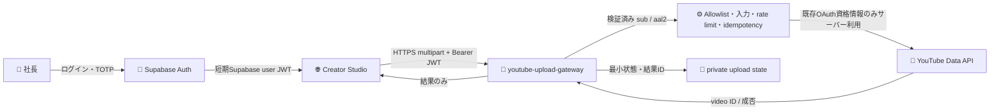
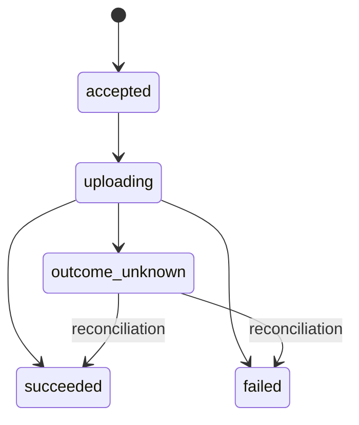

# YouTube安全認証ゲートウェイ設計 v1

_FieldRise YouTube Creator Studio — 2026-09-25。設計のみ。コード・Supabase設定・Secret・OAuth設定・実アップロードは本変更の対象外。_

---

## 1. 要約と設計判断

本書は、公開静的ページのYouTube Creator Studioから、社長本人が動画を確認して明示操作した場合に限り、YouTube Data APIへ非公開動画をアップロードするための認証ゲートウェイを定義する。

**基準案はSupabase Authの利用者JWTで保護したSupabase Edge Function** とする。Edge Functionは検証済みJWTの`sub`がサーバー側の単一許可ユーザーIDと一致すること、匿名ユーザーでないこと、追加認証後の`aal2`であることを確認する。アップロード処理は常に`privacyStatus=private`に固定し、ブラウザからその値を指定・上書きできないようにする。

ただし、現状の公開先・要件には実装前に解消が必要な二点がある。

1. **JWTの矛盾**：Edge FunctionへBearerで送るSupabase access JWT自体が短期のbearer credentialであり、Supabaseのブラウザセッションにはrefresh tokenも伴う。指示の「access/refresh tokenをブラウザへ出さない」がSupabaseセッショントークンも含む文字どおりの禁止なら、ブラウザ直結JWT案とは両立しない。その場合はサーバー側セッションを持つBFFへ切り替える。
2. **GitHub PagesのOrigin境界**：GitHub Pagesの通常のProject siteは`<owner>.github.io/<repository>/...`形式で公開される。Originにはパスが含まれないため、CORSで`https://fieldrisejapan.github.io`を許可しても`/FieldRise`だけには限定できない。専用カスタムドメイン等でOriginを分離する判断が必要である。[¹][²]

この二点、デプロイ済み`youtube-upload`の実際の設定、実動画でのサイズ・所要時間を確認するまで、**実装・投稿ボタン有効化を行わない**。

## 2. 現状・前提・非目標

| 項目 | 本書で確認できた状態 |
|---|---|
| Creator Studio | `automation/sns_auto_posting/youtube/`に静的UIあり。動画はMP4、公開設定はprivate固定、投稿ボタンは無効。|
| 既存アップロード関数 | リポジトリ上の説明では`youtube-upload`が`x-fieldrise-upload-secret`を要求する。関数ソース・実デプロイ設定はリポジトリにないため、JWT検証設定・CORS・実際のリクエスト契約は未確認。|
| YouTube OAuth | 既存指示ではGoogle OAuth Clientと`youtube.upload` scope、Supabase側callbackの存在が記録されている。Google access/refresh tokenはサーバー側のみ。値は本書に記載しない。|
| 今回の範囲 | 設計文書と完了報告のみ。コード変更、Supabase設定・Authユーザー・Edge Function・DB変更、Secret/OAuth変更、実アップロードはしない。|

**信頼境界**：GitHub Pagesは静的フロントエンドであり、サーバー側Secretを保持できない。Supabase Authのpublishable/anon keyとProject URLは公開前提値として扱えるが、`service_role`、YouTube upload secret、Google OAuth client secret、Google access/refresh tokenはフロントエンド、GitHub Pages、ログ、エラー応答へ一切出さない。

## 3. 構成図



図中のブラウザからEdge Functionまでは**別Origin間の通信**である。CORSはブラウザ制御であって認証・認可の代替ではない。

## 4. 全体案と認証方式の比較

### 4.1 ゲートウェイ方式

| Approach | Tradeoffs | Cost | Setup Complexity |
|---|---|---|---|
| Supabase Auth + JWT保護Edge Function（CTO基準案） | Supabase既存基盤を使い、本人確認を検証済みJWTへ結び付ける。独自Cookie/セッションサーバーが不要。一方でブラウザにSupabaseセッションが必要で、GitHub Pagesとはcross-origin。 | 既存Supabase契約内で始められる想定。実プラン、Authのメール配送費、Edge利用枠は未確認。 | 中。ユーザーallowlist、MFA、CORS、rate limit、idempotency、動画サイズ・実行時間の試験が必要。 |
| 専用OriginのBFF（サーバー側Authセッション + HttpOnly cookie） | ブラウザからSupabase JWTを直接見せない要件に対応しやすい。Cookie CSRF防御、PKCE callback、セッション保管・更新・失効の責任が増える。静的GitHub Pages単独では実現できない。 | Supabaseに加え、サーバー/Workerのホスティング・独自ドメイン・運用費が発生し得る。 | 高。既存デプロイ先・DNS・cookie境界・セッション管理を新たに決める必要。 |

**条件付き推奨**：Supabase Auth + JWT保護Edge Functionを優先する。ただし、ブラウザでSupabase sessionを使うことが許容され、かつStudioを専用Originにできる場合に限る。Supabaseのaccess/refresh tokenを実行時も一切ブラウザへ置かないことが必須なら、上表のBFF案を再設計・承認してから着手する。

### 4.2 ログイン方式（社長1名の管理画面）

| Approach | Tradeoffs | Cost | Setup Complexity |
|---|---|---|---|
| **Email OTP + TOTP MFA（推奨）** | パスワード再利用・リセットを避け、メール確認の後にAuthenticator codeで`aal2`を要求する。メールアカウント侵害は依然リスク。self-signupは無効にし、既存の恒久Authユーザーだけを認める。 | Supabase契約とメール配送経路に依存。メール配信設定・費用は未確認。 | 中。Authユーザー事前作成、`shouldCreateUser:false`、redirect allowlist、TOTP enrollment、サーバー側AAL2強制が必要。 |
| Email + password + TOTP MFA | メールboxを開けない第三者からOTPを奪われにくい一方、強固な一意パスワード管理・漏えい対応が必要。TOTPも要求する。 | Supabase契約内想定。パスワード管理・追加サーバー費用は通常不要。 | 中。password policy、recovery、MFA、アカウント回復手順の設計が必要。 |
| Google OAuth + TOTP MFA | 既存Googleアカウントの組織管理を利用できる。Identity provider設定・同意画面・redirect保護が増える。YouTubeのGoogle OAuthとSupabaseログイン用Google OAuthは別の資格情報・scopeとして分離する。 | Supabase契約とGoogle provider運用条件に依存。 | 高。provider設定と権限の最小化・審査・アカウント紐付け確認が必要。 |

Email OTP/Magic Linkは`shouldCreateUser:false`で未登録アカウントの自動作成を避け、認証後にTOTPを検証して`aal2`へ到達させる。Supabase資料上、Email OTP/Magic Linkは既定でリクエスト間隔60秒、期限1時間であり、短縮値とメール配送方法は設定前に承認・確認する。[³][⁴] TOTPの画面を用意するだけでは不十分で、upload gateway自体がJWTの`aal`を確認しなければならない。[⁵]

## 5. 認証・認可・セッションフロー

1. 社長は許可されたStudio OriginでEmail OTP認証を開始する。新規Authユーザー作成は許可しない。
2. Auth callbackを完了し、TOTP challenge/verifyを通してAAL2 sessionを得る。PKCEを使う場合、開始時とcallback時に同一ブラウザーのcode verifierが必要で、Auth codeは一回限り・短時間有効である。[⁶]
3. Creator StudioはSupabase SDK管理の**ユーザーJWT**を、TLS経由の`Authorization: Bearer`としてgatewayへ送る。HTML/JSへJWT値を埋め込まず、ログ・URL・分析イベントへも記録しない。
4. `youtube-upload-gateway`はSupabaseのuser-auth方式でJWTを検証する。Hosted Edge Functionの`verify_jwt`は有効のままとし、現行公式パターンでは`withSupabase({ auth: 'user' })`により検証済みuser claimsを得る。[⁷]
5. 検証後、サーバー側`user-id allowlist`を含む次の条件をすべて確認する。失敗時はfail closed。
   - 署名、発行者、期限等はSupabaseの検証ライブラリ/Edge認証層に委任する。自前でJWTをdecodeして信頼したり、暗号アルゴリズムを実装しない。[⁸]
   - `role === "authenticated"`、`sub`が設定済みの**単一許可ユーザーUUID**と完全一致。
   - `is_anonymous !== true`。Supabase匿名ユーザーも`authenticated` roleを使うため、roleだけで区別しない。[⁹]
   - `aal === "aal2"`。不足時は投稿を拒否し、UIには再認証/MFA案内だけを返す。
   - 必要なら`session_id`の現存性を検証し、サインアウト直後の残存JWTを拒否する。Supabaseは通常JWT expiryまで有効なbearer tokenとして扱うため、即時失効要件の有無を決める。[¹⁰]
6. gatewayはmultipartとidempotencyを検証後、動画とmetadataをYouTubeへ送り、結果IDと状態だけを返す。privacyはサーバー側で必ず`private`。
7. ブラウザはサインアウト操作を提供する。セッション保管をlocalStorageにするか、sessionStorage/メモリーにするかは前述のtoken禁止条件と運用要件の合意後に決める。XSS対策なしにブラウザ内bearer credentialを安全と見なさない。

## 6. リソースモデルと状態

| Resource | 主な属性 | 権限・保存方針 |
|---|---|---|
| Allowlisted administrator | `user_id` (UUID)、有効/無効状態 | サーバー側のみ。最初は単一UUIDの環境設定を推奨。メールアドレスや`user_metadata`の自己申告値で認可しない。 |
| Upload attempt | `upload_id`、`user_id`、idempotency key、payload fingerprint、state、YouTube video ID、時刻 | private schema/table、ブラウザのData APIへ公開しない。動画本文・JWT・refresh tokenを保存しない。 |
| Upload state | `accepted → uploading → succeeded / failed / outcome_unknown` | 遷移はgatewayのみ。再送で重複作成しない。`outcome_unknown`は自動再実行せず、確認・照合作業へ送る。 |



## 7. Gateway API v1

### 7.1 共通契約

- Base URL: `https://<project-ref>.supabase.co/functions/v1/youtube-upload-gateway`
- Version prefix: `/v1`。既存v1の意味を変更するbreaking changeは禁止。将来互換性を壊す場合は`v2`を追加し、移行期間と廃止日を告知する。
- 認証: `Authorization: Bearer <Supabase user JWT>`、Supabase公開`apikey`ヘッダー。公開keyは認証手段ではなく、JWT・allowlist・MFAチェックを省略しない。
- 成功応答とエラー応答に`Cache-Control: no-store`。エラーは`application/problem+json`。
- Collection/list endpointを設けないためページネーションは不要。upload状態取得は個別リソースのみ。

### 7.2 Endpoint

| Method / URI | 目的 | 成功応答 | 主な失敗 |
|---|---|---|---|
| `POST /v1/uploads` | 最終確認済み動画1件を同期uploadする。 | `201 Created`。`upload_id`、`video_id`、`status: succeeded`、`privacy_status: private`だけ。 | `400`, `401`, `403`, `409`, `413`, `415`, `422`, `429`, `502`, `503`, `504`。 |
| `GET /v1/uploads/{upload_id}` | 同一user所有の処理結果を復旧確認する。 | `200 OK`。`upload_id`、state、成功時`video_id`のみ。 | 未存在・他user所有は同じ`404`。`401`, `403`, `404`, `429`, `503`。 |

`POST`は`multipart/form-data`、Partsは`video`、`title`、任意の`description`、HeaderはUUID形式の`Idempotency-Key`。余分なpart、複数動画、クライアント指定の`privacyStatus`、動画内metadata上書きfieldは拒否する。

**動画サイズ**：YouTube APIの最大256GBはGoogle側のAPI上限であり、Supabase Edge Functionの許容サイズではない。Supabase公式の現行Hosted runtime docsは256MBメモリ、Free 150秒/Paid 400秒のwall-clock等を記載するが、同資料にHTTP request bodyの明示上限はない。[¹¹][¹²] 初期gateway上限は**暫定50 MiB**を運用提案とし、正式上限ではない。採用前に対象Supabase plan、実動画、`multipart`パーサーとYouTube転送時のメモリピーク・p95所要時間・idle timeoutを測定し、失敗する場合はEdge multipart直送を採用せず、専用staging/worker方式を別途設計する。

```yaml
openapi: 3.1.0
info:
  title: FieldRise YouTube Secure Upload Gateway
  version: 1.0.0
  license:
    name: Proprietary
    identifier: LicenseRef-FieldRise
  description: Single-admin, private-only upload API. No credentials or source values are embedded.
servers:
  - url: https://{project_ref}.supabase.co/functions/v1/youtube-upload-gateway
    variables:
      project_ref:
        default: project-ref-placeholder
paths:
  /v1/uploads:
    post:
      operationId: createPrivateYoutubeUpload
      summary: Create one private YouTube upload
      security:
        - SupabaseUserJWT: []
          SupabasePublishableKey: []
      parameters:
        - in: header
          name: Idempotency-Key
          required: true
          schema:
            type: string
            format: uuid
      requestBody:
        required: true
        content:
          multipart/form-data:
            schema:
              type: object
              additionalProperties: false
              required: [video, title]
              properties:
                video:
                  type: string
                  format: binary
                  description: One MP4 video; provisional 50 MiB cap pending measured approval.
                  x-maxBytes: 52428800
                title:
                  type: string
                  minLength: 1
                  maxLength: 100
                  description: UTF-8; reject YouTube-forbidden angle brackets.
                description:
                  type: string
                  description: Optional; at most 5000 UTF-8 bytes; reject angle brackets.
                  x-maxBytes: 5000
      responses:
        "201":
          description: Upload created with private visibility.
          headers:
            Cache-Control:
              schema: { type: string, const: no-store }
          content:
            application/json:
              schema: { $ref: "#/components/schemas/UploadResult" }
        "400": { $ref: "#/components/responses/BadRequest" }
        "401": { $ref: "#/components/responses/Unauthorized" }
        "403": { $ref: "#/components/responses/Forbidden" }
        "409": { $ref: "#/components/responses/Conflict" }
        "413": { $ref: "#/components/responses/TooLarge" }
        "415": { $ref: "#/components/responses/UnsupportedMedia" }
        "422": { $ref: "#/components/responses/Validation" }
        "429": { $ref: "#/components/responses/RateLimited" }
        "500": { $ref: "#/components/responses/Internal" }
        "502": { $ref: "#/components/responses/UpstreamFailure" }
        "503": { $ref: "#/components/responses/Unavailable" }
        "504": { $ref: "#/components/responses/OutcomeUnknown" }
  /v1/uploads/{upload_id}:
    get:
      operationId: getYoutubeUpload
      summary: Get an upload result owned by the current user
      security:
        - SupabaseUserJWT: []
          SupabasePublishableKey: []
      parameters:
        - in: path
          name: upload_id
          required: true
          schema: { type: string, format: uuid }
      responses:
        "200":
          description: Current state and, on success, video ID.
          content:
            application/json:
              schema: { $ref: "#/components/schemas/UploadResult" }
        "401": { $ref: "#/components/responses/Unauthorized" }
        "403": { $ref: "#/components/responses/Forbidden" }
        "404": { $ref: "#/components/responses/NotFound" }
        "429": { $ref: "#/components/responses/RateLimited" }
        "500": { $ref: "#/components/responses/Internal" }
        "503": { $ref: "#/components/responses/Unavailable" }
components:
  securitySchemes:
    SupabaseUserJWT:
      type: http
      scheme: bearer
      bearerFormat: JWT
    SupabasePublishableKey:
      type: apiKey
      in: header
      name: apikey
  schemas:
    UploadResult:
      type: object
      additionalProperties: false
      required: [upload_id, status, privacy_status]
      properties:
        upload_id: { type: string, format: uuid }
        status:
          type: string
          enum: [accepted, uploading, succeeded, failed, outcome_unknown]
        video_id: { type: string, description: Present only after confirmed success. }
        privacy_status: { type: string, const: private }
    Problem:
      type: object
      additionalProperties: false
      required: [type, title, status, request_id]
      properties:
        type: { type: string, format: uri }
        title: { type: string }
        status: { type: integer }
        detail: { type: string, description: "Sanitized, actionable, contains no provider payload or secret." }
        instance: { type: string }
        request_id: { type: string, format: uuid }
  responses:
    BadRequest:
      description: Malformed multipart, missing/extra parts, or invalid idempotency header.
      content: { application/problem+json: { schema: { $ref: "#/components/schemas/Problem" } } }
    Unauthorized:
      description: Missing, invalid, expired, or revoked session JWT.
      content: { application/problem+json: { schema: { $ref: "#/components/schemas/Problem" } } }
    Forbidden:
      description: Anonymous/non-allowlisted user, AAL below aal2, or rejected Origin.
      content: { application/problem+json: { schema: { $ref: "#/components/schemas/Problem" } } }
    Conflict:
      description: Idempotency key reused with a different request, or conflicting active operation.
      content: { application/problem+json: { schema: { $ref: "#/components/schemas/Problem" } } }
    TooLarge:
      description: Request or video exceeds the approved measured limit.
      content: { application/problem+json: { schema: { $ref: "#/components/schemas/Problem" } } }
    UnsupportedMedia:
      description: Unsupported MIME type or file signature.
      content: { application/problem+json: { schema: { $ref: "#/components/schemas/Problem" } } }
    Validation:
      description: Title/description or payload validation failed.
      content: { application/problem+json: { schema: { $ref: "#/components/schemas/Problem" } } }
    RateLimited:
      description: User or channel rate limit exceeded; include Retry-After.
      headers:
        Retry-After: { schema: { type: integer } }
      content: { application/problem+json: { schema: { $ref: "#/components/schemas/Problem" } } }
    UpstreamFailure:
      description: Sanitized YouTube API rejection or upstream failure.
      content: { application/problem+json: { schema: { $ref: "#/components/schemas/Problem" } } }
    Internal:
      description: Sanitized unexpected internal failure.
      content: { application/problem+json: { schema: { $ref: "#/components/schemas/Problem" } } }
    Unavailable:
      description: Auth, DB, or YouTube dependency unavailable before upload outcome is ambiguous.
      content: { application/problem+json: { schema: { $ref: "#/components/schemas/Problem" } } }
    OutcomeUnknown:
      description: Gateway timed out after upload may have reached YouTube; do not retry under a new key automatically.
      content: { application/problem+json: { schema: { $ref: "#/components/schemas/Problem" } } }
    NotFound:
      description: Upload ID not found or not owned by the authenticated user.
      content: { application/problem+json: { schema: { $ref: "#/components/schemas/Problem" } } }
```

#### 7.3 エラーtype URI一覧

`type`は安定したURNとし、全エラー本文は`application/problem+json`。`detail`は利用者が取れる行動だけを示し、YouTube/Supabase raw response、JWT、token、Secret名/値、スタックトレースを含めない。

| HTTP | type URI | 意味 |
|---:|---|---|
| 400 | `urn:fieldrise:youtube-gateway:error:bad-request` | multipart/header不正 |
| 401 | `urn:fieldrise:youtube-gateway:error:unauthorized` | JWT欠落・期限切れ・無効 |
| 403 | `urn:fieldrise:youtube-gateway:error:forbidden` | allowlist/AAL/匿名/Origin不一致 |
| 404 | `urn:fieldrise:youtube-gateway:error:not-found` | 不在または他ユーザー所有。両者を区別しない |
| 409 | `urn:fieldrise:youtube-gateway:error:conflict` | 同じキーで内容が異なる/競合 |
| 413 | `urn:fieldrise:youtube-gateway:error:payload-too-large` | 承認済みサイズ超過 |
| 415 | `urn:fieldrise:youtube-gateway:error:unsupported-media-type` | MIME/形式不許可 |
| 422 | `urn:fieldrise:youtube-gateway:error:validation` | title/description不正 |
| 429 | `urn:fieldrise:youtube-gateway:error:rate-limited` | 制限超過。`Retry-After`を付ける |
| 500 | `urn:fieldrise:youtube-gateway:error:internal` | 一般化された予期しない失敗 |
| 502 | `urn:fieldrise:youtube-gateway:error:upstream` | YouTube APIの拒否/失敗 |
| 503 | `urn:fieldrise:youtube-gateway:error:unavailable` | 依存サービス未利用 |
| 504 | `urn:fieldrise:youtube-gateway:error:outcome-unknown` | 結果照合が必要。新しいキーでの自動再送は禁止 |

## 8. CORS・ブラウザ防御

- Studioの**承認済み専用Origin**だけをallowlistに登録する。`Access-Control-Allow-Origin`をリクエストの任意Originへ反射せず、`Vary: Origin`を設定する。
- `OPTIONS` preflightではOriginを検査し、`POST, GET, OPTIONS`、`Authorization, apikey, x-client-info, content-type, Idempotency-Key`だけを許可する。Bearer方式では`Access-Control-Allow-Credentials`を付けない。
- Supabase公式`withSupabase` wrapperはCORS/OPTIONSを自動処理する。ただし本要件はOrigin限定なので、採用SDK版でallowlistを保証できるかを検証する。保証できない場合は明示的な手動allowlist/preflight処理を使いながら、JWT検証と`verify_jwt`を無効化しない。[¹³]
- `Origin`確認はCSRF/ブラウザ送信面の補助策であり、認証ではない。非ブラウザcallerはOriginを偽装できるため、JWT、AAL2、UUID allowlistを常に必須にする。
- 現行の`https://fieldrisejapan.github.io`は他Project siteとホストを共有し得る。**path `/FieldRise`をCORS allowlistで分離できない**。専用カスタムドメイン/専用ホスト、または明示的リスク受容が必要。GitHub Pagesは静的配信で、サーバーコードは実行しない。[¹][²]
- CSP等のレスポンスヘッダー・script供給経路は公開先の実設定を調査してから確定する。第三者script、inline script、外部tag managerは避け、XSSをsession窃取の重大脅威として扱う。

## 9. Payload検証・privacy固定

| 入力 | gatewayで行う検証 |
|---|---|
| multipart | body byte数上限を読み込み前と読み込み中の双方で確認。`video`は1件だけ、未知のpartは拒否。Content-Length不在でもstream上限を必ず適用。 |
| 動画 | v1ではUIと同じMP4だけを許可。MIME、`.mp4`名、MP4 container signatureを相互確認する。ユーザー指定filenameをパスとして使用しない。空ファイル/複数ファイル拒否。 |
| `title` | 必須、空白trim後1–100文字、YouTube仕様で禁止される`<`/`>`を拒否。Unicode境界を一貫して数える。 |
| `description` | 任意、UTF-8で最大5,000 bytes、`<`/`>`を拒否。JavaScript文字数だけでbyte上限を代用しない。 |
| Privacy | API schemaに入力欄を作らない。サーバーがYouTube `status.privacyStatus`を必ず`private`として設定する。YouTube videos.insertのタイトル100文字・description 5,000 bytes仕様に合わせる。[¹⁴] |
| OAuth/token | clientからGoogle OAuth credentialsを一切受け取らない。保存済みrefresh tokenはserver-side処理のみで更新する。 |

## 10. 二重送信防止・状態永続化

UIのdisabled/loading lockはUX上の補助でしかない。サーバー側で`user_id + Idempotency-Key`のunique constraintを必須とする。

1. ブラウザは最終確認のクリック1回ごとにUUID idempotency keyを生成し、ネットワークリトライ時は同じkeyを使う。
2. gatewayは認可後すぐDBに処理レコードを原子的に作成し、同じkeyの競合を排除する。
3. request fingerprintが既存と同一なら既存状態/結果を返す。異なるpayloadでの再利用は409。
4. YouTube成功の確定後、`video_id`と`succeeded`を保存してから応答する。DB保存前に関数が落ちた等で結果が不明なら`outcome_unknown`とし、自動再投稿しない。必要な場合はYouTube channel側を照合して状態を手動確定する。
5. 状態記録とrate-limitはprivate schema/tableで管理する。browserから直接select/writeさせず、gatewayのadmin clientもこの用途に最小限使用する。保存期間・監査要件はCTO承認後に設定し、動画/認証情報は永続化しない。

## 11. Rate limit

- AuthのEmail OTP配送頻度制限を有効にし、匿名sign-inを無効にする。
- gatewayは**1ユーザーにつき同時upload 1件**、初期案として**15分あたりupload開始3回**をDBの原子的カウンターで制限する。status GETは別枠にする。数値は実運用頻度に応じCTOが調整する。
- Edgeは複数instanceで動くため、インメモリーcounterを単独の制御にしない。`user_id`単位に加え、必要ならIP由来の短命な補助キーを追加し、IPそのものはログ/長期保存しない。
- `429`では`Retry-After`だけを返す。YouTube API側の実project quotaと`videos.insert`枠を事前に確認し、アプリ側のlimitをより低く設定する。Googleの現在のAPI referenceにはupload関連quota情報があるが、実project値をConsoleで別途確認する。[¹⁵]

## 12. `youtube-upload`との内部接続方式

| 方式 | 良い点 | 主なリスク/条件 | 判定 |
|---|---|---|---|
| 新gatewayから既存関数をHTTPSで呼び、`x-fieldrise-upload-secret`をサーバーだけで付与 | 既存処理を比較的早く再利用でき、secretはブラウザに出ない。 | gateway側にも同じ共有secretを保持。2 function間の設定・timeout・CORS・JWT検証が別々。旧functionが直接公開されている限り、secret漏えい時の影響が残る。既存関数の`verify_jwt`/secret check/呼出仕様が未検証。 | **代替案**。既存コード・設定・通信契約を監査でき、gateway以外のアクセス制限も試験できたときだけ採用。 |
| 既存YouTube upload処理を監査可能な共有moduleへ抽出し、gatewayから直接呼ぶ | 内部HTTPと共有secretを不要にでき、検証済みuser identityからYouTube処理までの境界が明確。 | 現リポジトリに既存Edge Functionソースがない。ソース回収・監査・回帰テスト・両functionの再配置が必要。 | **推奨**。ただし既存処理の完全なソースとデプロイ契約を回収するまで実装しない。 |

共有module方式が成立しない場合、既存関数をHTTP呼出しする案に安易にfallbackしない。gatewayだけでなく、既存`youtube-upload`を直接呼ぶ攻撃経路・JWT/CORS・内部secret漏えい時の封じ込めを運用担当が確認する。

## 13. Secrets・設定配置

| 名称/種別 | 配置 | ブラウザへ出すか | 用途/注意 |
|---|---|---:|---|
| Supabase Project URL | 静的UIの公開設定 | 可 | endpoint識別情報。実URLは本書に書かない。 |
| Supabase publishable/anon key | 静的UIの公開設定 | 可 | 公開識別key。単独で投稿認証に使わない。 |
| Allowlisted user UUID | Edge Functionのserver-side設定、またはprivate DB | 不可 | UUID1件だけ。メール/metadataではなくJWTの`sub`と比較する。これは秘密credentialではないが不要な露出は避ける。 |
| Supabase signing private/shared key | Supabase Auth管理 | **不可** | gatewayに手動複製しない。JWT検証はSupabase認証層/公式検証手段を使用。 |
| Supabase `service_role`/secret key | Supabase管理のEdge runtimeのみ、必要最小限 | **不可** | Gatewayに不要なadmin権限を付けない。`withSupabase`のadmin clientはprivate idempotency state等に限定。 |
| `YOUTUBE_UPLOAD_SECRET` | HTTP relay方式のみgateway/既存functionのserver-side secret設定 | **不可** |共有module方式では新gateway用に増設しない。値は文書/ソース/テストログへ記載しない。|
| Google OAuth Client Secret | Supabaseの保護されたOAuth設定/必要なserver-side secret | **不可** | 静的JSへ置かない。|
| Google YouTube refresh/access token | 現行の保護されたserver-side OAuth保管場所 | **不可** | ブラウザへコピーしない。暗号化保存・refresh/失効・アクセス監査の現状は実装前に確認。|
| TOTP seed/recovery code | Supabase AuthのMFA管理 | **不可** | recovery codeをアプリログ/サポート記録へ保存しない。|

値、実project-ref、OAuth client ID、ユーザーUUIDはこの設計書へ記載しない。

## 14. 想定攻撃と対策

| 脅威 | 主な対策 | 残余リスク/検査 |
|---|---|---|
| 公開JSからupload secret/Google token窃取 | credentialはserver-only。フロントの静的検査で禁止文字列と全送信先を検査。 | XSSが成立するとログイン済みユーザー操作が可能。CSP/依存script/DOM injectionをレビュー。 |
| 有効JWTを持つ一般authenticated/匿名userの悪用 | `sub` UUID allowlist、`is_anonymous`拒否、`aal2`必須、`role`照合。 | allowlist UUIDを設定・ローテートする管理者手順が必要。 |
| JWT再利用/窃取 | HTTPS、短い有効期限、AAL2、必要なら`session_id`のliveness check、no-store。URL/log/storage exposureを抑制。 | browser sessionを完全に排除する要件ならBFFを選択。 |
| CORS誤設定/他GitHub Pages projectからの呼出 | Origin完全一致allowlist、独自domainでOriginを分離、CORSとauthを別々にテスト。 | `github.io`の共有Originを使用する間はpath分離できず、同一Originの別ページを信頼境界として区別できない。 |
| CSRF | Bearer Authorizationのみ。CORS Origin check、cookie credentialを使わない。 | BFF/cookie案ではCSRF token、SameSite、Origin/Fetch Metadataを別途必須。 |
| 公開設定で投稿/権限拡大 | Gatewayがprivacyをprivate固定し、未知fieldを拒否。最終確認clickを毎回必須。 | YouTube側のチャンネル・API project制約は実プロジェクトで検証。 |
| 巨大/偽装multipart・resource exhaustion | Content-Lengthの早期判定、stream上限、part個数/MIME/signature、初期size cap、同時実行制限。 | Supabaseの実request上限と最悪実行時間は本環境で未検証。 |
| 再送/二重投稿 | UUID idempotency key、DB unique constraint/state machine、outcome_unknownの自動再試行禁止。 | YouTube成功後DB書込み前の中断は手動照合が必要。 |
| token/provider errorの漏えい | Problem Detailsのallowlist message、upstream body/stack/token redact、`request_id`だけ記録。 | error mappingのunit/integration testが必要。 |
| abuse/quota枯渇 | user/IP rate limit、1 active upload、YouTube quota監視、`Retry-After`。 | rate limit store障害時はfail closed。 |
| HTTP relay内部secret漏えい | shared moduleを優先。relay時は独立secret、最小権限、rotation計画、既存function直接経路の監査。 | デプロイ設定を確認するまでrelay可否を確定しない。 |

## 15. 実装手順（今後の承認後。今回は実施しない）

1. CTO/社長がtoken禁止の意味、専用Origin、許可Supabase user、TOTP必須、動画上限を決定する。
2. 既存`youtube-upload`のソース・`verify_jwt`・secret check・OAuth refresh-token保管を**値を表示せず**監査し、共有module化可否を決める。
3. stagingでallowlist・AAL2・匿名拒否、private table、atomic idempotency/rate-limit stateを設計・レビューする。
4. Supabase Authの恒久管理ユーザー、Email OTP設定、redirect allowlist、TOTP enrollmentを承認された手順で構成する。メール配送条件を確認する。
5. `youtube-upload-gateway`を`verify_jwt=true`で実装。認証、Origin/CORS、入力、idempotency、rate limit、sanitized errorの順にfail-closedする。
6. internal module方式でprivate固定のYouTube uploadを呼ぶ。relay方式を例外採用する場合はgatewayにのみsecretを設定し、既存function直呼びも別途閉じる。
7. 検証済みの最大サイズをOpenAPI/UIへ同じ値で設定。対象Supabase planでメモリ、duration、timeout、large upload、途中切断を計測する。
8. secret scan・CORS・Auth・RLS/private schema・injection・二重送信・failure injectionのstaging gateを通す。
9. 社長/彩花CTOがgo/no-goを承認した後だけ、UIの投稿buttonを有効化。最初の実投稿は別途明示承認後、private固定の試験動画1件とする。

## 16. テスト計画

| 分類 | ケース | 期待結果 |
|---|---|---|
| JWT | 無し、形式不正、署名不正、期限切れ、別project発行JWT | 401、providerの秘密情報なし。 |
| 認可 | 別のauthenticated user、allowlist UUID不一致 | 403。DB状態/YouTube APIに到達しない。 |
| 匿名/MFA | `is_anonymous=true`、`aal1`、`aal2` | 前2件403、aal2のみ次段へ。 |
| CORS | 正常Origin、不許可Origin、Origin欠落、OPTIONS、共有GitHub Pages origin | allowlist以外は拒否。shared originのpath-isolation不能を確認。JWT checkはpreflight後のPOSTで必須。 |
| Payload | 空/multiple/extra part、oversize streaming、Content-Length詐称、wrong MIME、MP4 signature不一致 | 400/413/415、途中読み込み停止、YouTube未呼出。 |
| Metadata | 空title、101文字、`<>`、description 5001 UTF-8 bytes、Unicode境界 | 422。privacy client overrideは禁止。 |
| Idempotency | 同一key同一payloadの同時POST、同key別payload、gateway timeout後の再確認 | 1回だけYouTube呼出、衝突409、outcome_unknownは自動再投稿しない。 |
| Private | 任意のclient body、DB書込み、既存function設定にpublic等を指定 | YouTube requestは常にprivate。 |
| Rate limit | 15分開始上限、同時upload上限、rate store停止 | 429/503 fail closed、`Retry-After`。 |
| Logging/error | YouTube 4xx/5xx、token refresh失敗、例外/timeout | log/Problemにrequest IDのみ。動画本文、JWT、Google token、secret、raw upstream bodyなし。 |
| Contract | OpenAPI lint、実際のmultipart、status owner isolation | lint成功。自分以外のupload IDは404。 |

**実投稿なしで行う検証**：mock YouTube clientとstaging用テスト資格情報を使い、payload・Auth・failure injection・idempotencyを試験する。real YouTube upload testは本依頼では実施せず、将来の明示承認を要する。

## 17. ロールバック・緊急停止

- 投稿異常時はまずStudio投稿buttonを無効のままにし、`youtube-upload-gateway`をundeploy/deny-allへ戻す。認証・CORS・allowlist不整合時はfail closed。
- `youtube-upload`旧functionはソースと設定を監査してから変更する。gateway rollback後も旧functionに到達できるか確認し、必要なら旧endpointのserver-side secret/権限を別途停止する。
- Supabase Auth sessionをsign-out/revokeし、allowlistから該当UUIDを削除できる運用を準備する。
- Secret漏えい時は漏えい区分に合わせGoogle OAuth token revoke/再認可、relay secret rotationを行う。値をGitHubへ記録しない。
- idempotency stateと成功済みvideo IDを保全して、rollback中に同じvideoを再投稿しない。設定変更・OAuth revoke等は別途承認後に実施する。
- 戻し先は現行UIの無効化状態、`youtube-upload-gateway`未公開、既存の保護されたOAuth経路。通常のUI rollbackは機能を無効にする方向を優先する。

## 18. 未解決事項・彩花CTO確認事項

| ID | 決定/確認が必要な点 | なぜ必要か | 推奨初期判断 |
|---|---|---|---|
| D1 | 「access/refresh token禁止」にSupabase user access JWT/refresh tokenも含むか | 含むならbrowser→JWT Edge Functionとは両立しない。 | Supabase sessionは実行時browser credentialとして許可するのか、BFFへ変えるのか明示。 |
| D2 | Studioの本番専用Origin/カスタムドメイン | `https://fieldrisejapan.github.io`ではrepository pathごとのCORS境界がない。 | 別siteから分離できる専用Originを採用する。 |
| D3 | Supabase Auth恒久userのUUID、email、TOTP enrollment手順 | user IDを推測/自動作成できない。 | 社長の既存恒久user UUIDのみをserver-side allowlistに置く。値は文書化しない。 |
| D4 | Supabase契約planとEdgeのruntime実測、動画上限 | 50 MiBは仮提案で、platform request上限ではない。Free/Paid wall-clock差も影響する。 | 実動画の最大サイズ/90p時間を測定し、成功率に基づき承認。 |
| D5 | 既存`youtube-upload`のsource、`verify_jwt`、secret validation、直接アクセス可能性 | Repoにはfunction sourceがなく、relay/共有moduleを確定できない。 | sourceを回収し、共有module化を第一候補に監査。 |
| D6 | Supabase Email delivery/redirect・MFA/Session設定と実プラン | Auth運用のUX・配信信頼性・期間制限を決める。Session lifetime/inactivity controlsは公式資料上Pro以上の場合がある。 | Email OTP + TOTP、self signup禁止、redirect exact-matchを採用候補にする。 |
| D7 | upload状態のretention/監査期間、rate-limit閾値、手動outcome_unknown照合責任者 | 個人情報最小化と二重投稿防止に必要。 | Private metadataだけ短期保持し、owner/operatorを決める。 |
| D8 | YouTube API project quota・OAuth保管場所/暗号化・token refresh監視 | project設定・実運用状態は本設計作業で閲覧/変更していない。 | OwnerがConsoleとSupabase側を別途点検する。 |
| D9 | CSP/security headersとGitHub Pages配信経路 | browser tokenを扱うため、XSSを抑えるheader設定が必要。 | 専用Origin/CDNのheader設定を確認し、実効CSPをブラウザー試験する。 |

## 19. 実装開始ゲート

以下すべてが文書化・承認されるまで、実装・Secret設定・投稿button有効化・実投稿へ進まない。

- D1 token解釈とD2 dedicated originの決定
- D3 allowlisted Auth UUIDとTOTP/AAL2運用
- D4 動画上限と許容時間の実測
- D5 既存関数ソース/認証境界の監査と接続方式
- allowlist・private-only・idempotency・rate-limit・error redactionの設計レビュー
- stagingテスト完了と、実upload試験に対する社長の別途明示承認

## 参考資料

[^1]: GitHub Docs, “Creating project pages manually.” https://docs.github.com/articles/creating-project-pages-manually (閲覧: 2026-09-25)。Project site pathの形式、静的サイト配信について。
[^2]: GitHub Docs, “About custom domains and GitHub Pages.” https://docs.github.com/en/pages/configuring-a-custom-domain-for-your-github-pages-site/about-custom-domains-and-github-pages (閲覧: 2026-09-25)。Project/User/Organization siteのdomain構成について。
[^3]: Supabase Docs, “Passwordless email sign-in.” https://supabase.com/docs/guides/auth/auth-email-passwordless (閲覧: 2026-09-25)。Email OTP/Magic Link、`shouldCreateUser`、既定の頻度/期限、redirectについて。
[^4]: Supabase Docs, “User sessions.” https://supabase.com/docs/guides/auth/sessions (閲覧: 2026-09-25)。access/refresh tokenとsession lifetimeについて。
[^5]: Supabase Docs, “Multi-Factor Authentication.” https://supabase.com/docs/guides/auth/auth-mfa (閲覧: 2026-09-25)。AAL1/AAL2とサーバー側強制について。
[^6]: Supabase Docs, “PKCE flow.” https://supabase.com/docs/guides/auth/sessions/pkce-flow (閲覧: 2026-09-25)。callback code、verifier、同一browser/device条件について。
[^7]: Supabase Docs, “Securing Edge Functions.” https://supabase.com/docs/guides/functions/auth (閲覧: 2026-09-25)。user JWT保護関数と`withSupabase({ auth: 'user' })`について。
[^8]: Supabase Docs, “JSON Web Token (JWT).” https://supabase.com/docs/guides/auth/jwts (閲覧: 2026-09-25)。claim、署名検証、JWKS、shared secretへの注意について。
[^9]: Supabase Docs, “Anonymous Sign-Ins.” https://supabase.com/docs/guides/auth/auth-anonymous (閲覧: 2026-09-25)。匿名ユーザーがauthenticated roleを使うこと、`is_anonymous`について。
[^10]: Supabase Docs, “User sessions.” https://supabase.com/docs/guides/auth/sessions (閲覧: 2026-09-25)。logoutとsession_idによる即時失効確認について。
[^11]: Supabase Docs, “Limits.” https://supabase.com/docs/guides/functions/limits (閲覧: 2026-09-25)。Hosted Edge runtimeのmemory/CPU/duration/idle timeoutについて。
[^12]: YouTube Data API, “Videos: insert.” https://developers.google.com/youtube/v3/docs/videos/insert (閲覧: 2026-09-25)。YouTube側動画・MIME・quotaのAPI仕様。Supabaseのrequest limitではない。
[^13]: Supabase Docs, “CORS (Cross-Origin Resource Sharing) support for Invoking from the browser.” https://supabase.com/docs/guides/functions/cors (閲覧: 2026-09-25)。OPTIONS・CORS・wrapperの扱いについて。
[^14]: YouTube Data API, “Videos.” https://developers.google.com/youtube/v3/docs/videos (閲覧: 2026-09-25)。title 100文字、description 5,000 bytesのフィールド制約について。
[^15]: YouTube Data API, “Videos: insert.” https://developers.google.com/youtube/v3/docs/videos/insert (閲覧: 2026-09-25)。アップロードAPI・認証scope・quotaに関する資料。
