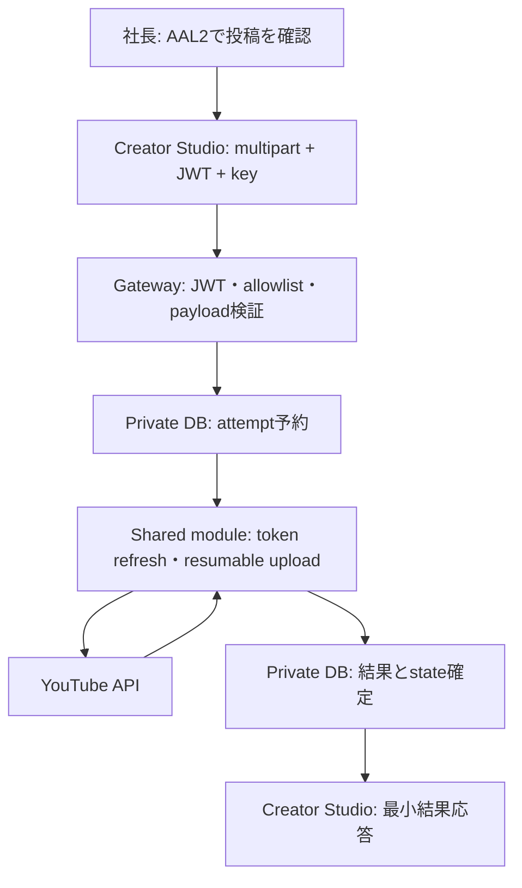

# YouTube安全Upload統合 Phase 3-A 設計

対象: FieldRise YouTube Creator Studio
作成日: 2026-09-26 (JST)
状態: 実装前設計のみ。コード、DB、Auth、Secret、Deploy、YouTube APIは変更・実行していない。

## 1. 推奨統合方式

**A案: 既存upload処理の安全な核をshared server-side moduleへ抽出し、認証済み`youtube-upload-gateway`から直接呼ぶ方式を推奨する。**

Gatewayが唯一のブラウザー向け投稿入口となり、JWT検証、authenticated/non-anonymous、AAL2、単一UUID allowlist、入力検証、rate limit、idempotencyを通過した後だけshared moduleを呼ぶ。Google OAuth資格情報とrefresh tokenはサーバー内でのみ使う。Gateway経路では`YOUTUBE_UPLOAD_SECRET`を使わない。

既存コードから再利用するのは、Google refresh tokenをサーバー側で取得してaccess tokenを更新する処理、resumable uploadの通信、private metadata生成のうちレビュー・テストで確認できた部分。旧FunctionのHTTP認証、入力fallback、raw error logging、HTTP response処理は移植しない。

ただし実upload経路を有効にする前に、OAuth callback hardening、永続idempotency状態、結果不明時の再投稿防止、ログredaction、実行時間・メモリ測定、旧Function閉鎖が必須。今回の設計書だけでは実uploadを開始しない。

## 2. 読み取り専用の現行確認

2026-09-26にSupabase上の稼働ソースを読み取り専用で再確認した。Secretやtokenの値、DB行、OAuth応答本文は取得していない。

| Function | 現在の状態 | 現行コードの主な役割 |
|---|---|---|
| `youtube-upload` | ACTIVE、version 7、`verify_jwt=false` | `YOUTUBE_UPLOAD_SECRET`と`x-fieldrise-upload-secret`を厳密比較。service-role clientで`youtube_oauth_tokens`のrefresh tokenを取得し、Google access tokenを更新。YouTube resumable uploadを開始して動画をPUTする。 |
| `youtube-oauth-callback` | ACTIVE、version 8、`verify_jwt=false` | OAuth `code`をGoogle token endpointへ交換し、refresh tokenをDBへupsertする。stateの照合、開始sessionとのbinding、許可channel ID検証はない。 |
| `youtube-upload-gateway` | ACTIVE、version 4、`verify_jwt=true` | Supabase claims検証、AAL2/allowlist等の認可、入力検証、DB受付、validation_only応答。現行ソースにGoogle/YouTube API呼び出しはない。 |

既存監査書は`youtube-upload` version 6、callback version 7を記録している。今回の読み取りでは各々version 7、8だった。したがって版数が進んだことを記録し、Phase 3-B着手時に稼働ソースとGit管理対象の差分を再確認する。ローカルrepositoryにはgatewayコードはあるが、既存upload/callbackのソースは含まれていない。

### 2.1 既存`youtube-upload`処理の確認

1. **refresh token取得**: service-role clientが`youtube_oauth_tokens`から`id=1`の`refresh_token`列だけをselectする。
2. **Google access token更新**: Google OAuth token endpointへclient ID、client secret、refresh token、refresh grantを送る。取得tokenはメモリ上で利用し、DB保存しない。
3. **resumable upload開始**: videos insert resumable endpointへmetadataをPOSTし、成功時の`Location`をupload URIとして得る。
4. **video PUT**: 得たupload URIへ動画streamを単一PUTする。途中再開の実装はない。
5. **title**: trim後に先頭100文字を使う。空・非文字列ならテスト用既定タイトルを使用する。
6. **description**: 先頭5000文字を使う。非文字列なら既定文を使う。UTF-8 byte数検証はない。
7. **privacyStatus**: metadataで`private`固定。
8. **notifySubscribers**: upload開始URLのqueryで`false`。
9. **categoryId**: `10`固定。
10. **selfDeclaredMadeForKids**: `false`固定。公開前に動画とチャンネルの実際の視聴者区分がこの値と合うか所有者が確認する。
11. **timeout**: 明示的timeout/AbortSignalなし。
12. **Googleエラー処理**: Google token更新失敗はHTTP statusだけを記録。upload開始・動画PUT失敗ではraw error body先頭500文字をログへ記録する。
13. **raw response logging**: あり。Google uploadエラー本文先頭500文字を出力。
14. **retry**: 明示的retry/backoffなし。
15. **upload成功判定**: 動画PUTがOKならJSONを読む。JSON parseやID欠落は明確な検査なく成功経路へ進み、`result.id ?? null`を応答する。
16. **videoId**: 成功応答に`result.id`またはnullを含める。
17. **旧認証境界**: `verify_jwt=false`。POSTの`x-fieldrise-upload-secret`が環境変数`YOUTUBE_UPLOAD_SECRET`と一致した場合に実処理へ進む。ブラウザーから呼ばない。CORSは認可境界になっていない。

現行コードは過去のprivate upload成功実績を支えた通信手順の参照元として扱うが、既存の入力・認証・ログ・失敗時処理をそのまま再利用してはならない。

## 3. A案 / B案比較

| 評価項目 | A: shared moduleをGatewayから直接呼ぶ | B: Gatewayから旧Functionをserver-to-server呼出し |
|---|---|---|
| Secret境界 | BrowserにはJWTと公開Supabase情報のみ。GatewayはGoogle資格情報と必要なDB credentialをserver-sideで使用。旧共有upload secretをGateway経路から除ける。 | Browserには何も追加しない。Gatewayに`YOUTUBE_UPLOAD_SECRET`を持たせ、旧Function側にも同じsecretとGoogle資格情報を維持する。二つのFunction間に追加のserver-side credential境界が残る。 |
| 攻撃面 | 呼出しはGatewayからupload moduleへの内部関数呼出し1回。Gatewayは高価値の処理を直接持つため、認証・入力順序を誤らない設計が必要。 | 公開Function URLへの追加HTTP hop。旧URLは引き続き到達可能で、secretを得た主体はGatewayを通らず直接呼べる。ssrf/誤転送/再送面も増える。 |
| 成功コード再利用 | Google token refresh/resumable通信のコードをDeno moduleとして明示的に抽出。HTTP入口は再利用しない。 | 既存Function全体をHTTP APIとして再利用しやすいが、古い入力処理・エラー・ログ仕様も残りやすい。 |
| 二重認証 | GatewayのJWT・AAL2・allowlistに加え、Google OAuth credentialでprovider認証。Function間の共有secretは不要。 | Gatewayでuser認証・認可した後、旧Functionが機械間secretも確認する。これは利用者の追加認証ではなくservice-to-service認証であり、冗長なsecret運用になる。 |
| 保守性 | 一つの認可/状態管理/エラー契約を保てる。共有moduleのinterfaceとDeno依存を固定する必要がある。 | Functionごとに応答形式・timeout・CORS・secret rotate・版数があり、運用箇所が二重化する。 |
| エラー処理 | Gatewayがproviderの例外を固定enumへ変換し、raw bodyを境界外へ出さない。 | 下流のstatus/bodyとGateway mappingの双方をsanitizeする必要。旧関数の汎用エラーでもraw loggingは別途残る。 |
| timeout | 一つの実行deadline内にGoogle token refreshとuploadを収める。Edge上限に達する場合はworker等の別設計が必要。 | GatewayのHTTP待ちと旧Functionの実行timeoutが連鎖し、先にGatewayがtimeoutしても下流uploadが続く可能性がある。 |
| idempotency / 重複投稿 | Gateway DBの状態遷移をprovider呼出し前後に直接制御しやすい。 | Gatewayと旧Functionの双方でidempotencyを管理しないと、Gateway応答喪失後の再呼出しで二重投稿し得る。旧Functionには現状idempotencyなし。 |
| ログ漏えい | moduleへlogger interfaceを注入し、許可した項目しか出さない。 | Gateway、旧Function、Supabase platform logsの3箇所を相互に監査・redactする必要がある。 |
| 旧Function閉鎖 | A経路の切替後、旧HTTP endpointを閉じ、Google処理をGateway専用moduleに一本化できる。 | Gatewayが旧Functionに依存し続けるため、旧Functionを内部専用にする追加仕組みが必要。公開URLと共有secretだけではネットワーク上のprivate endpointにならない。 |
| rollback | Gatewayをvalidation_only / upload-disabledへ戻せばprovider呼出しを止められる。旧公開endpointへ戻すrollbackはしない。 | 旧Functionを温存して切戻しやすい一方、secretの直接upload経路も温存される。 |
| テスト容易性 | provider fetch/clock/logger/DB境界を依存注入し、Googleをmockして通信順・状態遷移・秘密値不出力を検証しやすい。 | Gateway・HTTP認証・旧Function・network timeoutのintegration testが必要で、障害再現が複雑。 |

**判断**: A案を採用候補とする。B案は移行中の短期間の互換案に限る。もしB案を採る場合も、内部向けという名称だけで安全とみなさず、旧Function直接呼出しを認証・閉鎖する仕組み、専用machine credential、request timeout、下流idempotencyの独立レビューが必要。

## 4. Phase 3の最終request flow

1. 社長がAuth UIでMagic LinkとTOTPを完了し、現在sessionがAAL2であることを確認。
2. Creator Studioは動画/タイトル/任意説明を表示し、最終確認操作の後だけGatewayへPOST。requestごとに新規UUIDの`Idempotency-Key`を使用する。
3. Gatewayは`verify_jwt=true`のまま、Supabase正式JWT検証、authenticated、non-anonymous、AAL2、server-side単一allowlist、Origin、method、multipart、動画・metadata、rate limitを検証する。
4. private DB上でuser+keyを原子的にreserveし、同じkey・同じpayloadなら既存状態を返し、同じkeyで違う内容なら409にする。
5. 状態を`accepted`として確定。YouTube token refreshが失敗し、YouTube upload開始前と確定できる場合は安全な失敗状態へ遷移する。
6. YouTube resumable upload開始直前に状態を`uploading`へ原子的に変更し、shared moduleを呼ぶ。
7. Google OAuth refresh token/access tokenはserver-sideだけで使用。metadataはprivate固定、notifySubscribers=false。動画streamはYouTube resumable sessionへ送る。
8. Googleから有効なvideo IDを含む完了応答を受けた後、DBを`succeeded`にしてからブラウザーへ応答する。
9. ブラウザー応答は成功時に`success`, `status`, `privacyStatus`, `videoId`, `request_id`等の最小情報だけ。JWT、token、Google raw body、email、内部UUID/Secretは返さない。videoIdは社長本人のUIで確認可能だがログには記録しない。



## 5. Secret境界

| 値/credential | Browser | Gateway/shared module | 旧upload/callback |
|---|---|---|---|
| Supabase Project URL、publishable key | 公開設定として利用可 | Auth確認に利用可 | 不要または既存用途 |
| Supabase user JWT | Auth SDKの現行sessionからAuthorization header内部でのみ利用。画面/console/log/独自保存禁止 | 署名・issuer・expiryを正式検証し、必要なclaimのみ使う | 不要 |
| `YOUTUBE_GATEWAY_ALLOWED_USER_ID` | 禁止 | server-side設定のみ。値をコード/ログ/応答へ出さない | 不要 |
| `YOUTUBE_UPLOAD_SECRET` | 絶対禁止 | A案の通常Gateway pathでは使用しない | 旧endpoint閉鎖まで残る場合もserver-sideのみ。gatewayから旧Functionを呼ぶB案でのみserver-to-server使用 |
| Google OAuth Client Secret、refresh/access token | 絶対禁止 | server-sideでのみ利用。値を返さない/ログに出さない | 既存のserver-side処理 |
| service role | 絶対禁止 | DB操作に必要な場合だけserver-side使用。特権範囲を抑制し、通常のuser JWTから分離 | 既存サーバー側だけ |
| resumable upload `Location` URI | 絶対禁止 | bearer相当の秘密としてメモリ内でのみ使用する設計を優先。永続化が必要なら暗号化方法を別途承認 | 既存upload memory内 |

Gatewayのserver-side credentialはブラウザーcredentialと別の信頼境界で扱う。プロジェクトのFunction secret共有範囲をPhase 3-B前に確認する。Gateway pathへ`YOUTUBE_UPLOAD_SECRET`を不用意に追加しない。既存Functionを閉じる前に同名secretの削除が他Functionへ与える影響を確認する。

## 6. Shared upload module構成案

候補配置:

```text
supabase/functions/_shared/youtube-upload/
  mod.ts                 # 公開interfaceとorchestrator
  google-token.ts        # refresh token取得/Google access token更新
  resumable-upload.ts    # upload session開始・PUT・完了応答検査
  metadata.ts            # private固定のYouTube metadata
  errors.ts              # 固定codeへの分類。raw message/bodyを保持しない
```

- HTTP `Request`/`Response`、CORS、JWT、allowlist、UI契約、`YOUTUBE_UPLOAD_SECRET`をmoduleへ持ち込まない。
- 関数interfaceは`uploadPrivateVideo({videoStream, videoSize, title, description, signal})`相当とし、returnはdiscriminated union（confirmed success、definite failure、ambiguous outcome）とする。provider raw response/exceptionをcallerへ返さない。
- Supabase token repository、Google fetch、YouTube fetch、clock、logger、deadlineは依存注入し、mock可能にする。
- module内で常に`privacyStatus='private'`、`notifySubscribers=false`を設定する。`categoryId=10`と`selfDeclaredMadeForKids=false`は現行互換の仮値としてレビューする。視聴者区分はOwner確認なしにfalse固定を製品判断として承認しない。
- access token・refresh token・resumable URIはログ、例外文字列、返却objectのJSON stringifyに入れない。エラー型は固定enum/codeだけ。
- video完了判定はHTTP statusだけでなく、JSON parse成功と非空video IDを要求する。ID欠落/不正JSONは`outcome_unknown`に分類する。

## 7. Upload state machineとDB案

推奨状態:

```text
accepted -> uploading -> succeeded
                     -> failed          (providerへ作成されていないと確定)
                     -> outcome_unknown (作成された可能性を排除できない)
outcome_unknown -> succeeded / failed (照合作業でのみ確定)
```

- **accepted**: 認証・payload検証・idempotency予約が完了。YouTubeのvideos insert未開始。
- **uploading**: token refresh後、YouTube upload開始を試みる状態。Googleのrequest送信開始後に曖昧な通信障害があればunknownへ進む。
- **succeeded**: YouTubeの完了応答とvideo IDを確認し、同じattempt行へのDB書込も完了。
- **failed**: YouTubeにvideo作成が起きていないと確認できる確定失敗。次の再試行を許すかは同key lifecycleルールで制御する。
- **outcome_unknown**: YouTubeが動画を受領した可能性がある。異なるkeyや新sessionでの自動再投稿は禁止する。

特に、**動画PUTがYouTube側で完了した後にネットワークが切れ、Gatewayが完了応答またはvideo IDを受け取れない場合**は`succeeded`にも`failed`にもせず`outcome_unknown`へ遷移する。同じidempotency keyの再送は既存unknown状態を返し、YouTubeへの新しいupload sessionを開始しない。新しいkeyでのuploadも、人間がYouTube側の結果を確認し、CTO/Ownerがunknownを解消するまで開始禁止とする。単なるHTTP timeout、process restart、DB update failureを「投稿されなかった」根拠にしない。

Phase 1の既存DBは`processing / validated / failed`のみを許し、video ID/fingerprint/state lifecycleを保存できない。Phase 3-Bでは既存SQLを直接上書きせず、レビュー済みforward migrationで`state`制約と必要列/RPCを変更する。候補列は`user_id`, `idempotency_key`, `state`, `created_at`, `updated_at`, `payload_fingerprint`, `video_id`（succeeded時のみ）, `safe_error_code`, `attempt_count`, 必要なら`lease_expires_at`。Google credentialや動画本文は保存しない。

Unique keyは`(user_id, idempotency_key)`。fingerprintはmetadataの正規化表現と動画byte列の暗号学的hashから生成し、動画本文自体は永続化しない。same key/same fingerprintは既存状態を返して新しいYouTube requestを起こさない。same key/different fingerprintは409。1 active uploadとrate limitはDBで原子的に守る。user UUID/keyの値をログには出さない。

### 7.1 二重投稿防止

YouTube APIにこのGatewayのidempotency keyをそのまま渡して二重作成を防止する機能は前提にしない。まずDBでkeyを一度だけclaimし、同時実行はunique制約とtransaction lockで直列化する。再送は新規実行ではなくattempt状態の参照・回復になる。

YouTubeが動画を受理した後でresponseまたはDB確定が失われると、DBだけで成功可否を確定できない。`outcome_unknown`を保持し、**自動retry・新しいkeyによる同動画再投稿を止める**。Owner/CTOが安全なserver-side照合（チャンネルのuploads playlistと候補video metadata等）を承認し、候補が一意ならvideo IDを結び付ける。候補0件/複数/照合不能ならblocked状態のまま手動判断する。タイトルだけで同一動画と断定しない。

Resumable `Location` URIは再開に便利だが、保持すればcredential相当の秘密情報をDBに置くことになる。初期リリースではDBに平文保存しない。プロセス内で同一sessionの安全なresumeを試み、それでも確定できなければunknown/manual reconciliationに止める。後続で永続化が必要なら専用暗号化鍵・鍵rotation・access制御設計を別承認する。

## 8. Timeout / outcome_unknown戦略

- Google token refresh、resumable開始、動画転送、DB確定に独立deadlineを設け、全体がSupabase実行deadlineより前に完了するよう実測・設定する。数値は現在決めない。
- request abort/stream idle/overall deadlineを区別して記録する。Google upload開始前の明確な失敗は`failed`、Google requestを送信し受理有無が曖昧なら`outcome_unknown`。
- Gateway timeoutのHTTP応答は`504`相当の一般コードと`request_id`のみ。ブラウザー再送操作では同一keyで状態を照会し、サーバーはexisting attemptを返す。自動で新keyを発行しない。
- stale `uploading` rowを単純な`failed`へ戻さない。lease expiry後もまず`outcome_unknown`としてブロックする。DB worker/sweeper導入は別設計・承認事項。
- 初回の実環境試験は別途承認後の小さいMP4に限定し、2 MiB Phase 1制限を変更しない。メモリ、request body buffering、Edge wall-clock、Google transfer time、abort後の状態を記録する。

## 9. Sanitized logging / error response

ログはallowlist方式とし、`request_id`, 固定phase名, 固定error code, 数値HTTP status, elapsed milliseconds, 承認後の粗いサイズbucketだけに限定する。

**記録禁止**: JWT/Authorization、Google access/refresh token、Client Secret、`YOUTUBE_UPLOAD_SECRET`、user UUID、email、idempotency key、動画/metadata本文、Google raw body、例外message/stack、resumable URI、request headers全体。

`console.error(err.message)`やprovider response本文を記録しない。provider status/errorは許可済みのenumへ変換してから記録する。responseは固定文言と一般code、`request_id`のみ。成功時にvideo IDを本人のブラウザーへ返しても、サーバーログには書かない。テストでは各秘密らしいsentinel値をmock error/body/headerに埋め、responseとcapture loggerの両方に出ないことを確認する。

## 10. OAuth callback hardening計画

state対策とchannel bindingは**実uploadを有効にする前の必須gate**とする。callbackを使う再認可/credential差替えを先に安全にする。

1. 認可開始をserver-side endpointに集約し、暗号学的random stateを生成。hashしたstate、expiry、one-time statusをserver-sideに保存する。
2. stateを社長の現在の許可Auth user/sessionに結び付ける。callbackでstateのhash、expiry、未使用、同一user/sessionを検証し、成功/失敗どちらでも一度だけ消費する。state欠落・不一致・期限切れはcode交換前に拒否。
3. Google OAuth redirect URIを完全一致し、HTTP method/Content-Type/response headerを固定。callback query code/stateをaccess log、browser history、error responseに残さない。
4. code交換後、token scopeが必要最小限であることと、Googleの`channels.list(mine=true)`等で得た**channel ID**がserver-side許可channel IDと完全一致することを確認する。表示名だけで照合しない。異なるchannelならtoken保存せず拒否。
5. state validationとchannel verification成功後のみrefresh tokenを保存。保存schemaにはowner Auth user/channel binding、created/updated time、revocation metadataを設ける案を審査する。refresh token値はログ/返答なし。既存tokenを差し替える場合は別途承認・rollback計画を要求。
6. Google OAuth client secretと保存refresh tokenの保管・暗号化・backup/rotation・scopeを確認。stateハードニングだけで現在のrefresh tokenの本人/channelを自動証明した扱いにしない。

`youtube.upload` scopeだけで`channels.list(mine=true)`に必要なchannel identity情報を取得できるかは未確認。権限の最小化を維持してscope要件を確認し、**追加scopeが必要かは未解決事項としてOwner/CTOが判断する**。この設計段階ではscopeを変更しない。

## 11. 旧`youtube-upload`閉鎖計画

**推奨: 段階的停止。ただしGateway実uploadを有効化する前には旧直接経路を閉じる。**

1. Phase 3-Bの前提調査で現行version/source/Secret参照先/Google token table利用者を読み取り確認し、rollback用のソース版を社内で管理する（credentialを含めない）。
2. Gateway moduleをmockで検証し、validation_onlyのままstaging検証。実uploadのgo/no-go直前までは旧関数の稼働有無をCTO判断に従う。
3. 実upload試験より前に、旧Functionを410/no-op tombstoneへ置換またはFunctionを削除し、既存Function URLで投稿を開始できないことを確認する。確認後にだけGatewayへupload capabilityを導入/有効化する。両方が同時に実投稿できる期間を作らない。
4. `YOUTUBE_UPLOAD_SECRET`は旧関数終了と参照先確認後にrotate/removeを検討する。Secretがproject-wideかを調査し、他Functionへ影響する状態で独断削除しない。
5. “internal-only”として古い公開HTTP Functionを維持する方法は推奨しない。Function URLとshared secretだけなら、secretを得た主体が直接呼べる面が残る。

旧Functionの閉鎖時点・実際の削除/置換操作はPhase 3-Bの別承認を必要とする。今回変更なし。

## 12. 段階的テスト計画

| Gate | 検証 | 成功条件 |
|---|---|---|
| 0: source/config baseline | live版数、verify_jwt、source hash、Git source差分、Secret名だけを確認 | 新旧差分とdeploy対象が説明可能。値は取得しない。 |
| 1: module unit tests | token refresh、metadata、init POST、PUT、response ID欠落、timeout/abortをmock | private、notifySubscribers=false、タイトル/説明検証、token/raw body/URIのconsole出力なし。Google実呼出なし。 |
| 2: state/idempotency tests | same key same/different fingerprint、同時reserve、失敗状態、成功後DB障害、stale uploading | YouTube callはattemptにつき最大1つの新規session。ambiguousはoutcome_unknownでブロック。 |
| 3: auth/payload regression | missing/invalid JWT、AAL1、匿名、allowlist外、不正Origin、multipart超過 | 401/403/4xx、module未呼出。既存Auth/Creator Studio/TikTok/Instagram回帰なし。 |
| 4: callback security tests | state欠落/改ざん/再利用/期限切れ/session mismatch、別channel、scope不足 | code交換・DB保存前に拒否。許可channelだけをserver-side保存。Google呼出しはmock。 |
| 5: staging failure injection | token endpoint 4xx/5xx、YouTube init/PUT切断、response喪失、DB finish失敗 | Sanitized response/log。unknownは自動再投稿なし。 |
| 6: legacy closure gate | 旧endpointを実upload前にtombstone/削除し、旧URLへ安全な非機密リクエストを行ってupload経路が無効であることを確認 | 旧経路から新規YouTube uploadを開始できない。旧Functionを再有効化しないrollback手順が用意済み。 |
| 7: approved real private test | Gate 6通過後、別途社長/CTOの明示承認を得て、小さいMP4を1件だけ投稿 | private、許可channel、videoId照合、state succeeded。2 MiB cap維持。大容量計測は別承認。 |

秘密値scan、source diff、`git diff --check`、変更ファイル境界、Supabase migration reviewを各コード変更前後に行う。mock testは実Google/YouTube APIへ接続しない。

## 13. Rollback

- 不明な状態・エラー増加・token境界異常時は、Gatewayをupload-disabled/validation_onlyへ戻し、新たなYouTube呼出しを停止する。
- `uploading`/`outcome_unknown`状態と成功済みvideo IDは保持して、rollback中に再投稿させない。該当attemptを照合するまで同一チャンネルの新規uploadを一時blockする案を採用する。
- 旧`youtube-upload`の`verify_jwt=false`+shared-secret版へ自動rollbackしない。安全な戻し先はGatewayのvalidation_only、または投稿機能無効状態。
- DB migrationはdown migrationで履歴を消さず、forward fix/feature flagによる停止を優先する。既存attemptを削除・初期化しない。
- OAuth token revoke/再認可、Secret rotation、DB変更、Function削除/復旧は影響を確認し、別途承認後に実行する。

## 14. Phase 3-Bで変更予定のファイル案

実装承認後に確定する候補。今回の変更は本設計書1件のみ。

| 候補パス | 目的 |
|---|---|
| `supabase/functions/_shared/youtube-upload/` (新規) | Google token refresh、metadata、resumable uploadとtyped/sanitized resultを共有module化。 |
| `supabase/functions/youtube-upload-gateway/index.ts` | shared moduleの依存/credential wiring。`verify_jwt=true`維持。 |
| `supabase/functions/youtube-upload-gateway/handler.mjs` | validation_onlyから実upload state flowへの段階切替、認証後のmodule invocation。 |
| `supabase/functions/youtube-upload-gateway/policy.mjs` | 本番upload payloadの上限は計測・承認まで変更しない。 |
| `supabase/functions/youtube-upload-gateway/schema.sql` またはSupabase migration | 状態列、fingerprint、video ID、reserve/finish/failure transitionを拡張。既存DB変更は別承認。 |
| `supabase/functions/youtube-oauth-callback/index.ts` | state/session binding、channel ID verification、sanitized error。Live sourceを先にrepoへ安全に同期/比較。 |
| OAuth start endpoint/UI (既存配置を調査後に確定) | one-time state作成、恒久ユーザーsessionとのbinding。場所は未調査。 |
| `supabase/functions/youtube-upload/index.ts` | cutover時に旧endpointを閉鎖するtombstone/削除案。独立承認後のみ。 |
| `tests/youtube/test_youtube_upload_module.mjs` (新規) | mock providerの通信/metadata/error redactionテスト。 |
| `tests/youtube/test_upload_idempotency.mjs` (新規) | 状態遷移、競合、結果不明と再送防止。 |
| `tests/youtube/test_oauth_callback_security.mjs` (新規) | state、session、channel binding tests。 |
| `tests/youtube/test_gateway_check.mjs`、`test_auth_flow.mjs` | regression。現行Auth UI安全確認と既存試験を保持。 |

動画サイズ上限、投稿button有効化、実YouTube upload、Supabase本番migration/Deployはこの候補一覧に含むが、別々の明示承認なしに実施しない。

## 15. 未解決事項 / CTO判断事項

1. 現行`youtube-upload` v7とcallback v8のlive sourceをGit管理へ取り込むか、今後のFunction source-of-truthとdeploy手順をどう統一するか。
2. YouTubeで許可するchannel IDの安全な確認方法と、現行保存refresh tokenがそのchannelに属するかの検証責任者。
3. `selfDeclaredMadeForKids=false`および`categoryId=10`を対象動画に使ってよいか。動画ごとの適用基準。
4. SupabaseのFunction実行時間、memory、request body上限、Google transferの実測と実運用最大動画サイズ。2 MiBは引き続きPhase 1試験専用。
5. `youtube_oauth_tokens`の保存暗号化/backup/rotation、service-role keyのFunction利用範囲と最小権限化。
6. `outcome_unknown`時に誰がどの画面/YouTube APIで照合するか、何を一意一致条件にするか、手動確定の監査方法。
7. Idempotency行の保持期限、削除/匿名化、rate limit値、同時upload policy。
8. Resumable URIを永続化せずに回復可能性をどこまで提供するか。永続化するなら暗号鍵基盤とrotation方法。
9. OAuth callback hardeningとupload統合の順序。推奨はcallback/token-channel確認を先に完了し、その後でも別途実upload承認を得る。
10. `youtube.upload`だけでchannel identity確認が可能か。`channels.list(mine=true)`に追加scopeが必要な場合に許可するscopeとGoogle consent/re-authorization手順。今回の段階ではscope変更しない。
11. GitHub PagesのCSP/XSS対応とOrigin制約は既存D2方針の範囲で再確認が必要。CORSを認証として扱わない。
12. legacy endpointを閉じる時期。推奨は最初の実upload試験より前。旧endpointを復活させないrollbackとし、実upload二経路を重ねない。

## 16. Phase 3-B着手条件

- 彩花CTOがA案、state machine、OAuth hardening順、旧endpoint停止計画を承認。
- live Supabase sourceとGit sourceの差分を秘密値なしで把握し、変更対象を確定。
- callback state/session/channel bindingの仕様と許可channel IDをserver-sideで設定する運用を承認。
- DB migration/RPCの状態遷移、same-key replay、`outcome_unknown`対応をレビュー。
- `categoryId`/Made for Kids方針、log allowlist、timeout/size測定計画をOwnerが判断。
- mock-onlyテストがPASSした後、実private upload試験を行う別承認を得る。投稿ボタンはその後も単独で承認されるまで無効のまま。

**停止状態**: この文書は設計案であり、Phase 3-Bの作業GOではない。Commit/Push、実装、設定変更、Deploy、実uploadへ進まない。
