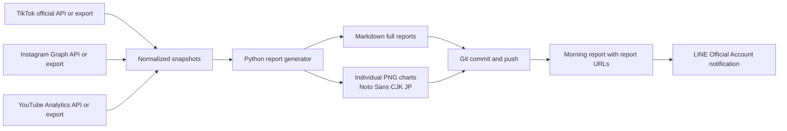

# Cross-Platform Analytics Architecture

## Purpose

This repository stores structured analytics reports for the following official accounts. The reports are generated as Markdown and individual PNG charts, committed to GitHub, and referenced from a morning LINE report.

| Platform | Account | Current source state | Target analytical depth |
|---|---|---|---|
| TikTok | [@fieldrizejapan](https://www.tiktok.com/@fieldrizejapan) | Official OAuth connection pending | Account growth, per-video views, likes, comments, shares, saves, content and hashtag patterns |
| Instagram | [@runa_girl8215](https://www.instagram.com/runa_girl8215/) | Authorized Business account connection available in the current task | Account growth, reach, views, interactions, saves, shares, format performance |
| YouTube | [@Runa-Girl8215](https://www.youtube.com/@Runa-Girl8215) | Public account baseline available; YouTube Analytics OAuth pending | Channel growth, video views, watch time, CTR, retention, traffic source, content and format performance |

> The TikTok and YouTube full reports must clearly distinguish public indicators from owner-only analytics. Owner-only figures are not inferred from public pages.

## Execution options

| Approach | Tradeoffs | Cost | Setup complexity |
|---|---|---:|---|
| Official API with scheduled updates | Provides the required owner-level metrics, reproducible daily data, and fully automated charts. Requires one-time developer-app OAuth approvals and secure repository secrets. | Platform API usage is generally free within service limits; hosting uses GitHub Actions allowances. | Medium |
| Scheduled report based on exported analytics files | Uses CSV/JSON exports placed in the repository or uploaded before the scheduled run. Does not require long-lived API tokens, but cannot independently collect daily owner-only metrics. | No additional API credential cost. | Low |

Both routes share the same data schema and report generator. The first route is preferred only after the appropriate account owner completes the platform consent screens; the second remains a safe fallback.

## Data flow

## Security model

The repository is private. Raw data, tokens, client secrets, and recipient identifiers must never be committed. Use repository secrets for credentials and omit them from logs. The LINE message contains only report links and summary text. Recipients of a private GitHub URL must have explicit repository access.

| Secret | Used by | Purpose |
|---|---|---|
| `TIKTOK_CLIENT_KEY` | TikTok collector | Identifies the TikTok developer application |
| `TIKTOK_CLIENT_SECRET` | TikTok collector | Exchanges and refreshes authorization tokens |
| `TIKTOK_REFRESH_TOKEN` | TikTok collector | Retrieves the account's authorized API access token |
| `INSTAGRAM_ACCESS_TOKEN` | Instagram collector | Retrieves account and media insights from Meta Graph API |
| `YOUTUBE_CLIENT_ID` | YouTube collector | OAuth client identifier |
| `YOUTUBE_CLIENT_SECRET` | YouTube collector | OAuth client secret |
| `YOUTUBE_REFRESH_TOKEN` | YouTube collector | Retrieves YouTube Data and Analytics access tokens |
| `LINE_CHANNEL_ACCESS_TOKEN` | LINE notifier | Authenticates outgoing notification requests |
| `LINE_TARGET_ID` | LINE notifier | Identifies the authorized recipient, group, or room |

## Morning reporting schedule

The configured schedule is **07:00 JST daily**. The refresh step must complete before the morning report is delivered. All reports are timestamped in JST. A failed collection does not overwrite the last valid report; the morning report instead links to the previous valid report and states the platform that failed.

## Reference documentation

1. [TikTok Display API overview](https://developers.tiktok.com/doc/display-api-overview)
2. [TikTok video query fields](https://developers.tiktok.com/doc/tiktok-api-v2-video-query)
3. [TikTok OAuth access-token management](https://developers.tiktok.com/doc/oauth-user-access-token-management)
4. [LINE Messaging API: sending messages](https://developers.line.biz/en/docs/messaging-api/sending-messages/)
5. [YouTube Analytics API reports.query](https://developers.google.com/youtube/analytics/reference/reports/query)
6. [YouTube Data API channels reference](https://developers.google.com/youtube/v3/docs/channels)
