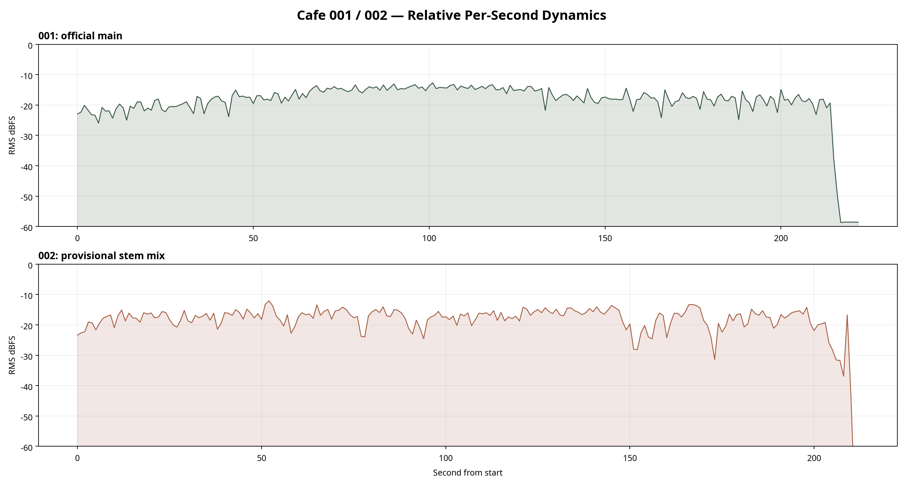

# Cafe 001・002｜DNA設計図 Ver.1

**作成日:** 2026-08-14
**目的:** 001・002の観測済み特徴を、今後のCafeシリーズで再利用・検証できる設計資産として整理する。
**重要な前提:** 001は正規Mainを基にした参照、002は承認前の4ステム合成版を基にした**暫定参照**である。以下の「DNA」は既存曲の複製指示ではなく、観測値に基づく制作・検証のガードレールである。楽器名、調性、ジャンル、主観的な音色は、聴取レビューまたはDAW確認が未完了の限り確定しない。

> **結論:** 最も堅い共通DNAは、Bass onsetが0.5秒未満、IntroでDrumsを前面化しないこと、主旋律的なVocalを前面化しないことです。001と002を同じ完成度の正本として扱わず、002の正式Mainとテンポ確定を先に解消します。

## 1. 証拠の信頼性

| 参照曲 | 使用した音源 | 信頼性 | 設計上の扱い |
|---|---|---|---|
| 001 | `001_reference_main.flac`、222.400秒、48 kHz、Stereo | **Verified Canonical**。元WAVとのPCM MD5整合、4ステム再構成相関1.000000・SNR 151.91 dBを確認済み。 | 完成曲の基準参照として使用可能。 |
| 002 | `002_reference_stem_mix.flac`、212.920秒、44.1 kHz、Stereo | **Provisional Stem Mix**。提供MainはRMS -240.00 dBFSの無音で、4ステム合成版は未承認の暫定参照。 | 比較仮説には使用可能だが、正式Mainの最終評価には使用しない。 |

根拠: [001 正解データ](../../reference_music/success_song_001.md)／[002 正解データ](../../reference_music/success_song_002.md)／[完全音響分析・ピアレビュー](2026-08-14_001-002_expert_peer_review.md)

## 2. 秒単位一覧表

各ファイルは開始から終了までの**1秒単位**で、RMS平均・RMSピーク・スペクトル重心・Low／Low-mid／Highのエネルギー比・曲内相対ダイナミクス帯を記録する。`pp`、`p`、`mp`、`mf`、`f`は、各参照音源内のRMS分位点による相対ラベルであり、演奏指示や絶対ラウドネス目標ではない。

| 参照曲 | 秒数範囲 | 行数 | 秒単位台帳 |
|---|---:|---:|---|
| 001 | 0–222秒 | 223 | [001 per-second DNA CSV](dna_assets/001_per_second_dna_20260814.csv) |
| 002 | 0–212秒 | 213 | [002 per-second DNA CSV](dna_assets/002_per_second_dna_20260814.csv) |

**再生成:** `python3 tools/generate_cafe_dna_assets.py`。解析は22050 Hz・モノラルで固定する。最後の不完全な1秒も明示的に残し、音源の曲尺と台帳の対応を失わない。

## 3. ダイナミクス推移

| 観測項目 | 001 Main | 002暫定stem mix | 設計上の解釈 |
|---|---:|---:|---|
| Global RMS mean | -18.03 dBFS | -17.94 dBFS | 平均値は近いが、002は暫定参照のため厳格な比較ゲートにはしない。 |
| RMS P10 / P90 | -29.64 / -12.98 dBFS | -26.98 / -13.72 dBFS | どちらも過度に一定ではない。候補曲では音圧のみで採否を決めず、聴取を併用する。 |
| Crest factor | 14.28 dB | 13.99 dB | 数値上は近い。002の値は正式Main確定後に再確認する。 |
| 最後の8秒 RMS | -43.84 dBFS | -30.92 dBFS | 終端エネルギーに差がある。Loopの合否は数値のみで判断しない。 |

根拠: [001 実測JSON](measurements/001_reference_main_metrics_20260814.json)／[002 実測JSON](measurements/002_reference_stem_mix_metrics_20260814.json)

## 4. 導入部・周波数DNA

| 項目 | 001 | 002 | 再現・検証の扱い |
|---|---:|---:|---|
| Bass初回Onset | 0.464秒 | 0.464秒 | **固定候補:** 0.5秒未満で低域主導の立ち上がり。 |
| その他／伴奏初回Onset | 2.299秒 | 0.255秒 | **B1の唯一の比較変数:** 0.255秒近傍と2.299秒近傍。 |
| Drums初回Onset | 未確定 | 1.161秒（追加分離では1.138秒） | Introで前面化しないことを維持。時刻は聴取・DAWで確認。 |
| 0–2秒 Low比率 | 0.9857 | 0.4928 | 001 MainはLow優勢。002 stem mixはLowとLow-midが拮抗。 |
| 0–2秒 Low-mid比率 | 0.0132 | 0.5068 | 002は伴奏の早期導入と整合する暫定観測。 |
| 0–2秒 High比率 | 0.0008 | 0.0001 | 導入は高域過多にしないことの補助根拠。 |
| Global spectral centroid | 1008.2 Hz | 655.5 Hz | 明るさの代理指標。楽器・音色の断定には使わない。 |

**Low／Mid／Highの役割整理:** Low（20–180 Hz）は導入の土台、Low-mid（180–2,000 Hz）は伴奏の到来時刻と密度を比較する主な観測帯、High（2,000–10,000 Hz）は導入で過多にしないための監視帯として扱う。これは周波数帯の音響的役割であり、個別楽器の確定ではない。

## 5. 楽器・ステムの再現優先度

以下は「音楽的な重要度」ではなく、現在の測定根拠にもとづく**再現検証上の優先度**である。星が少ないことは不要という意味ではなく、主成分としての根拠が弱いか、聴取での確認が未完了であることを示す。

| 要素 | 001 | 002 | 根拠・注意 |
|---|---|---|---|
| Bass | ★★★★★ | ★★★★★ | 両曲とも0.464秒にBass onset。IntroのBass低域比率は001 98.73%、002 84.21%。 |
| その他／伴奏ステム | ★★★★☆ | ★★★★★ | 001は2.299秒、002は0.255秒に初回Onset。B1の比較変数。楽器種と音数は未確定。 |
| Drums | ★☆☆☆☆ | ★☆☆☆☆ | 全体RMSは001 -57.36 dBFS、002 -62.82 dBFS。Introで前面化しない。 |
| Vocalステム | ★☆☆☆☆ | ★☆☆☆☆ | 全体RMSは001 -108.55 dBFS、002 -80.83 dBFS。分離残差の可能性を含む。 |
| 終端／Loop構造 | ★★★☆☆ | ★★☆☆☆ | 001 chroma類似度0.9914、002暫定値0.9255。ただし人の連結聴取前のため暫定。 |

## 6. Cafe001 DNA｜消してはいけない要素 TOP10

ここでの「消してはいけない」は、今後の生成候補で**最初に守るべき検証ガードレール**を意味する。001の意図や音楽的価値を一意に定義するものではない。

| 優先 | 要素 | 状態 | 根拠・運用 |
|---:|---|---|---|
| 1 | Bass onsetを0.5秒未満に置く | 固定候補 | 001・002とも0.464秒。自動検出後にDAWで確認する。 |
| 2 | Intro 0–2秒でDrumsを前面化しない | 固定候補 | 001のIntro Drums RMS -58.70 dBFS。音量だけでなく聴感も確認する。 |
| 3 | Lead vocalを前面化しない | 固定候補 | 001 Vocal RMS -108.55 dBFS。分離残差の可能性を含むため聴取を併用する。 |
| 4 | 低域を土台にした導入を守る | 固定候補 | 001 Main 0–2秒Low比率0.9857、Bass 98.73%。 |
| 5 | 伴奏導入を明示的な変数として扱う | 固定候補 | 001は2.299秒。早期導入案とは同時に他条件を変えない。 |
| 6 | 導入で高域過多にしない | 固定候補 | 001 Main 0–2秒High比率0.0008。音色名は確定しない。 |
| 7 | 音圧を過圧縮・過大にしない | 暫定 | 001 Global RMS -18.03 dBFS、crest 14.28 dB。候補曲の合否は聴取とセット。 |
| 8 | 終端→冒頭を聴取してLoop適性を確認する | 暫定 | 001 chroma類似度0.9914は補助値であり、シームレス判定ではない。 |
| 9 | 001の正本と002の暫定値を混同しない | 必須運用 | 001はVerified Canonical、002はProvisional Stem Mix。 |
| 10 | 実験では一度に一変数しか変えない | 必須運用 | B1では伴奏導入時刻のみを変更する。 |

## 7. 002の保留事項と再測定手順

| 優先 | 保留事項 | 完了条件 |
|---:|---|---|
| 1 | 002正式Main | 正しいMainを再書き出しし、無音でないこと、SHA-256、曲尺、sample rate、channels、4ステムとの整合を記録する。 |
| 2 | 002テンポ | 80.75、83.35、123.05 BPM候補をDAWグリッドと人の主拍で複数区間照合し、採用しない候補も記録する。 |
| 3 | 楽器・音数・音色 | 0–2秒、2–10秒、10–30秒、終端8秒をタイムコード付きで聴取レビューする。 |
| 4 | Loop | 終端8秒→冒頭8秒をDAWで連結し、クリック、拍ズレ、音量差、終止感を記録する。 |

## 8. Cafe004への引継ぎ

Cafe004の既存制作ファイルは未登録であるため、現時点では次の制作前ブリーフを作成した。Cafe004の制作開始時には、必ず本DNA設計図と [Cafe004 DNA引継ぎブリーフ](../../strategy/cafe004_dna_transfer_brief_v1.md) をセットで参照する。

## 9. 再現可能な生成・検証の順序

1. 002の正しいMainまたはstem mix正式承認を取得する。
2. 001を基準として、Bass onset、Intro Drums、Vocal非主成分を固定する。
3. B1では伴奏導入時刻だけを0.255秒近傍または2.299秒近傍に設定する。
4. 生成候補を同一スクリプトで秒単位台帳化し、DAW／人の聴取で未確定項目を確認する。
5. 結果をPattern DBと本DNA設計図の後続版に記録し、次の一変数を決める。

## 参照資料

- [完全音響分析・独立ピアレビュー](2026-08-14_001-002_expert_peer_review.md)
- [001・002ステム実測](2026-08-12_001-002-stem-measurement.md)
- [002追加分離ステム整合分析](2026-08-14_002-additional-other-split-analysis.md)
- [001参照仕様](../../reference_music/success_song_001.md)
- [002参照仕様](../../reference_music/success_song_002.md)
- [秒単位DNA台帳・ダイナミクス生成コード](../../../tools/generate_cafe_dna_assets.py)
