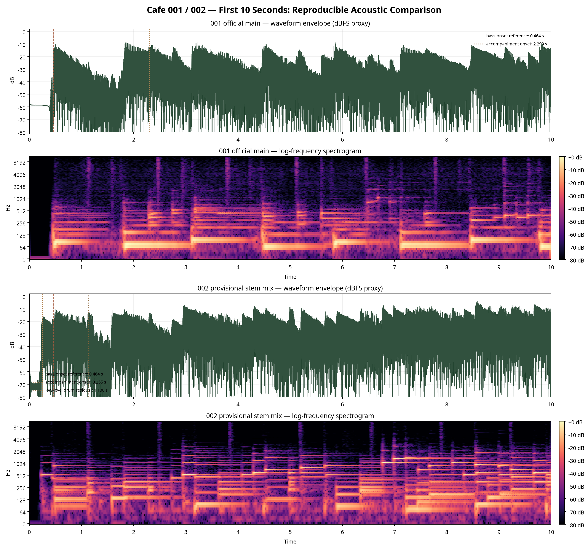

# Cafe 001・002｜完全音響分析・独立ピアレビュー

**作成日:** 2026-08-14
**対象:** Cafe reference tracks 001 / 002
**分析範囲:** 正本・ステム整合、再計測した音響特徴、導入部可視化、再現用ガードレール、Suno向けプロンプト骨格、生成候補の品質ゲート。
**前提:** 本レビューは提供資料内の観測値のみを使用する。音響特徴はすべて「観測」であり、楽器・調性・ジャンル・意図の確定ではない。

---

## 0. 判定ラベル

| ラベル | 意味 |
|---|---|
| **FACT** | supplied files に記録された測定値・メタデータ・整合結果。 |
| **INFERENCE** | FACTから限定的に導ける運用上の推定。反証可能。 |
| **UNKNOWN** | supplied files では未確認。聴取・DAW確認が必要。 |
| **BLOCKER** | 現時点で採用判断・比較判断を妨げる欠落または矛盾。 |

---

## 1. エビデンス品質監査

### 1.1 ソース信頼性

| 項目 | 001 | 002 |
|---|---|---|
| 参照状態 | **FACT:** 元Mainあり。`001_reference_main.flac` は元WAVとPCM MD5一致。4ステム合成はStudio Mainを相関1.000000、SNR 151.91 dBで再構成。 | **BLOCKER:** 提供MainはRMS -240.00 dBFSの無音。`002_reference_stem_mix.flac` は4ステムをゲイン正規化なしで合成した暫定参照であり、承認済み公式Mainではない。 |
| 比較に使える範囲 | **FACT:** Main全体・ステム・区間特徴の比較に使用可能。 | **INFERENCE:** ステムおよびステム合成版の観測比較は可能。ただしMain全体としての正式評価は保留。 |
| 主要ファイル | `audio/001_reference_main.flac`, 222.400 s, 48 kHz, Stereo。 | `audio/002_reference_stem_mix.flac`, 212.920 s, 44.1 kHz, Stereo, PCM_24。提供Mainは無音。 |
| 出典 | [source: music_ai/reference_music/success_song_001.md], [source: music_ai/analysis/cafe/measurements/001_reference_main_metrics_20260814.json] | [source: music_ai/reference_music/success_song_002.md], [source: music_ai/analysis/cafe/measurements/002_reference_stem_mix_metrics_20260814.json] |

**レビュー判断:**
- **001は高信頼の正規参照。**
- **002は「ステムミックス参照」としてのみ扱う。** 002の提供Mainが無音であるため、002のグローバル・区間・Loop関連のMain評価は、正式Mainの代替ではなく暫定観測である。

---

## 2. 002テンポ推定の不一致監査

### 2.1 観測値

| ソース | 対象 | 推定テンポ | 状態 |
|---|---|---:|---|
| 002 canonical record / stem measurement | Bass／Drums由来 | 80.75 BPM | **FACT:** アルゴリズム推定。DAWまたは聴取確認が必要。 |
| 002 stem-mix metrics | 4ステム合成版 full stem-mix | 123.05 BPM | **FACT:** アルゴリズム推定。002公式Mainではない。 |
| 002 additional split | 追加「その他」 | 123.05 BPM | **FACT:** ステム単体推定。曲全体値を置換しないと明記。 |
| 002 additional split | 追加「ドラム」 | 83.35 BPM | **FACT:** ステム単体推定。低レベル成分。 |
| 出典 |  |  | [source: music_ai/analysis/cafe/2026-08-12_001-002-stem-measurement.md], [source: music_ai/analysis/cafe/measurements/002_reference_stem_mix_metrics_20260814.json], [source: music_ai/analysis/cafe/2026-08-14_002-additional-other-split-analysis.md] |

### 2.2 不一致の扱い

**BLOCKER:** 002のテンポは現時点で確定できない。
80.75 BPMと123.05 BPMは、いずれもアルゴリズム推定であり、正式Mainの聴取・DAWグリッド確認が未完了である。

### 2.3 可能なアルゴリズム要因 — 結論ではない

以下は**INFERENCE**であり、どれも確定理由ではない。

| 可能要因 | 説明 |
|---|---|
| ステムごとのオンセット密度差 | Bass／Drumsでは約80 BPM台を選び、伴奏主成分またはfull stem-mixではより細かいオンセット列を拍として拾った可能性。 |
| タクトゥス選択の差 | ビートトラッカーが「ゆっくりした拍」と「細かい拍・サブディビジョン」のどちらを主拍とみなすかで値が変わる可能性。 |
| 3:2近傍の関係 | 80.75 × 1.5 = 121.125 BPMで、123.05 BPMに近い。三連・付点・シンコペーション等を断定はできないが、比率的には別階層の拍を拾った可能性がある。 |
| 低レベル成分の影響 | 追加「ドラム」は低レベルで83.35 BPM、追加「その他」は123.05 BPM。full stem-mixではその他成分のオンセットがテンポ推定を支配した可能性。 |
| 公式Main不在 | 002の正式なMainが無音であり、承認済みミックスに対するテンポ推定ではない。 |

**レビュー結論:**
002の設計値としてテンポを固定する場合、現時点では「80.75 BPM」も「123.05 BPM」も最終値として採用不可。DAW上で拍位置と知覚上の主拍を確認するまで、テンポは**暫定値**として扱う。

---

## 3. 001／002比較

### 3.1 Duration / source reliability

| 指標 | 001 | 002 | レビュー判定 |
|---|---:|---:|---|
| Duration | 222.400 s | 212.920 s | **FACT:** 002は約9.48 s短い。 |
| Main信頼性 | 元Main・FLAC整合あり。ステム再構成相関1.000000、SNR 151.91 dB。 | 提供Mainは無音。比較対象は未承認のstem mix。 | **BLOCKER:** 002は正式Main比較不可。 |
| 出典 | [source: music_ai/reference_music/success_song_001.md] | [source: music_ai/reference_music/success_song_002.md] |  |

---

### 3.2 Onset sequence

| 観測対象 | 001 | 002 |
|---|---:|---:|
| Bass初回Onset | 0.464 s | 0.464 s |
| Full / stem-mix first detected onset | 0.488 s | 0.255 s |
| その他ステム初回Onset | 2.299 s | 0.255 s |
| Drums初回Onset | supplied comparisonでは全体Drums RMSのみ。初回Onset値は未提示。 | 1.161 s。追加分離ドラムは1.138 s。 |
| 判定 | **FACT:** 両曲ともBassは0.5 s未満に立ち上がる。 | **FACT:** 002はその他ステムがBassより先に検出される。公式Mainでは未確認。 |
| 出典 | [source: music_ai/analysis/cafe/2026-08-12_001-002-stem-measurement.md], [source: music_ai/analysis/cafe/measurements/001_reference_main_metrics_20260814.json] | [source: music_ai/reference_music/success_song_002.md], [source: music_ai/analysis/cafe/measurements/002_reference_stem_mix_metrics_20260814.json], [source: music_ai/analysis/cafe/2026-08-14_002-additional-other-split-analysis.md] |

**INFERENCE:** Bass立ち上がり <0.5 s は両参照で再現性がある。
**UNKNOWN:** 「その他」ステムの楽器種、音数、演奏上の間は未確定。

---

### 3.3 Intro spectral balance

#### 0–2秒 full / stem-mix

| 指標 | 001 Main | 002 stem-mix |
|---|---:|---:|
| RMS mean | -26.76 dBFS | -24.25 dBFS |
| Spectral centroid | 1486.7 Hz | 754.8 Hz |
| Low 20–180 Hz ratio | 0.9857 | 0.4928 |
| Low-mid 180–2000 Hz ratio | 0.0132 | 0.5068 |
| High 2000–10000 Hz ratio | 0.0008 | 0.0001 |
| 出典 | [source: music_ai/analysis/cafe/measurements/001_reference_main_metrics_20260814.json] | [source: music_ai/analysis/cafe/measurements/002_reference_stem_mix_metrics_20260814.json] |

#### Bass stem 0–2秒

| 指標 | 001 Bass | 002 Bass |
|---|---:|---:|
| Bass低域比率 | 98.73% | 84.21% |
| Bass RMS | -26.85 dBFS | -29.00 dBFS |
| 出典 | [source: music_ai/reference_music/success_song_001.md] | [source: music_ai/reference_music/success_song_002.md] |

**FACT:** Bass stemでは両曲とも0–2秒の低域比率が高い。
**INFERENCE:** Introの低域主導は再現候補。ただし002 stem-mix全体では低域と中低域がほぼ拮抗しており、001 Mainとは異なる。
**UNKNOWN:** 0–2秒の聴感上の主役・音色名は未確認。

---

### 3.4 Global / full-section dynamics

| 指標 | 001 Main | 002 stem-mix |
|---|---:|---:|
| Global RMS mean | -18.03 dBFS | -17.94 dBFS |
| RMS P10 / P90 | -29.64 / -12.98 dBFS | -26.98 / -13.72 dBFS |
| Crest factor | 14.28 dB | 13.99 dB |
| Intro 0–2 s RMS | -26.76 dBFS | -24.25 dBFS |
| Intro 2–10 s RMS | -23.29 dBFS | -19.55 dBFS |
| Body 10–30 s RMS | -21.79 dBFS | -17.96 dBFS |
| Outro last 8 s RMS | -43.84 dBFS | -30.92 dBFS |
| 出典 | [source: music_ai/analysis/cafe/measurements/001_reference_main_metrics_20260814.json] | [source: music_ai/analysis/cafe/measurements/002_reference_stem_mix_metrics_20260814.json] |

**FACT:** Global RMS meanとcrest factorは近い。
**INFERENCE:** 002 stem-mixは0–30秒およびoutroで001より高いRMSを示す。
**BLOCKER:** 002は承認済みMainでないため、音圧・ダイナミクスの最終比較には使用不可。

---

### 3.5 Brightness proxy — spectral centroid

| 区間 | 001 Main | 002 stem-mix |
|---|---:|---:|
| Global mean | 1008.2 Hz | 655.5 Hz |
| 0–2 s | 1486.7 Hz | 754.8 Hz |
| 2–10 s | 1223.5 Hz | 684.6 Hz |
| 10–30 s | 1166.8 Hz | 537.3 Hz |
| Last 8 s | 932.1 Hz | 785.4 Hz |
| 出典 | [source: music_ai/analysis/cafe/measurements/001_reference_main_metrics_20260814.json] | [source: music_ai/analysis/cafe/measurements/002_reference_stem_mix_metrics_20260814.json] |

**FACT:** spectral centroidは全区間で001の方が高い。
**INFERENCE:** supplied metrics上、001は002 stem-mixより明るさ proxy が高い。
**注意:** spectral centroidは明るさの代理指標であり、楽器同定やミックス意図を示すものではない。

---

### 3.6 Outro / loop proxy

| 指標 | 001 Main | 002 stem-mix |
|---|---:|---:|
| Last 8 s time window | 214.400–222.400 s | 204.920–212.920 s |
| Last 8 s RMS | -43.84 dBFS | -30.92 dBFS |
| First/last 8 s chroma cosine similarity | 0.9914 | 0.9255 |
| 判定 | **FACT:** 調性特徴類似度は高い。ただしシームレスLoop判定ではない。 | **FACT:** stem-mix上の近似値。公式Mainでは未確認。 |
| 出典 | [source: music_ai/analysis/cafe/measurements/001_reference_main_metrics_20260814.json] | [source: music_ai/analysis/cafe/measurements/002_reference_stem_mix_metrics_20260814.json] |

**UNKNOWN:** 実際の終端→冒頭接続でクリック、拍ズレ、違和感がないかは未聴取。
**BLOCKER:** 002のLoop評価は正式Mainまたは承認stem-mixが必要。

---

### 3.7 Vocal presence

| 指標 | 001 | 002 |
|---|---:|---:|
| ボーカルステム全体RMS | -108.55 dBFS | -80.83 dBFS |
| 判定 | 主成分ではない観測。 | 主成分ではない観測。ただし001より高い。 |
| 注意 | 分離残差・残響等を含む可能性。 | 同左。 |
| 出典 | [source: music_ai/reference_music/success_song_001.md], [source: music_ai/analysis/cafe/2026-08-12_001-002-stem-measurement.md] | [source: music_ai/reference_music/success_song_002.md], [source: music_ai/analysis/cafe/2026-08-12_001-002-stem-measurement.md] |

**INFERENCE:** 主旋律的な歌唱を前面化しない設計は再現候補。
**UNKNOWN:** 聴取上の声・残響・分離残差の有無は未確認。

---

## 4. 最小再現可能デザインシステム

### 4.1 固定ガードレール候補

| ガードレール | 状態 | 根拠 | 運用上の注意 |
|---|---|---|---|
| Bass onsetを0.5 s未満に置く | **FACT → 固定候補** | 001/002ともBass初回Onset 0.464 s。 | 楽器名としてのBassはステム名に基づく。音色形容は聴取未確認。 |
| Intro 0–2 sでDrumsを前面化しない | **FACT → 固定候補** | Drums全体RMS: 001 -57.36 dBFS、002 -62.82 dBFS。Intro Drums: 001 -58.70 dBFS、002 -81.69 dBFS。 | 「強いDrums禁止」は運用ルールとして妥当。ただし聴感確認必須。 |
| Vocalを主成分にしない | **FACT → 固定候補** | Vocal RMS: 001 -108.55 dBFS、002 -80.83 dBFS。 | 分離残差の可能性があるため、聴取で歌唱有無を確認。 |
| Full mix RMSを過度に外さない | **暫定** | 001 Main -18.03 dBFS、002 stem-mix -17.94 dBFS。 | 002は公式Mainでないため、厳格ゲート化は保留。 |
| Loop-friendly構造を要求する | **暫定** | 001 chroma similarity 0.9914、002 stem-mix 0.9255。 | 数値はシームレス判定ではない。必ず終端→冒頭を聴取。 |
| テンポ80–86 BPM帯 | **暫定に降格推奨** | 001 86.13、002 Bass/Drums 80.75。ただし002 stem-mix 123.05。 | 002不一致解消まで、ハードゲートにしない。 |

出典: [source: music_ai/analysis/cafe/2026-08-12_001-002-stem-measurement.md], [source: music_ai/analysis/cafe/measurements/001_reference_main_metrics_20260814.json], [source: music_ai/analysis/cafe/measurements/002_reference_stem_mix_metrics_20260814.json], [source: music_ai/analysis/cafe_series_success_pattern.md]

---

### 4.2 一変数実験コントロール

| 実験変数 | 水準A | 水準B | 固定すべき他条件 |
|---|---:|---:|---|
| その他／伴奏ステム導入時刻 | 0.255 s近傍 | 2.299 s近傍 | Bass onset <0.5 s、Intro Drums控えめ、Vocal非主成分。 |
| Intro 0–2 s周波数バランス | 001型: low比率高め | 002 stem-mix型: low / low-mid拮抗 | テンポ・音圧・Drums条件を固定。 |
| Brightness proxy | 001型: centroid高め | 002 stem-mix型: centroid低め | 同一構成・同一音圧目標で比較。 |
| Outro energy | 001型: last 8 s RMS低め | 002 stem-mix型: last 8 s RMS高め | Loop聴取評価を必須化。 |
| Tempo | 80.75/86.13近傍 | 123.05近傍 | **現時点では実験保留推奨。** 002テンポ確定後に実施。 |

**レビュー判断:**
最初に検証すべき一変数は「伴奏導入時刻」。001と002で明確に異なり、かつ他の主要ガードレールを固定しやすい。

---

## 5. 最高優先の次測定と再現方法

| 優先 | 測定項目 | 目的 | 再現方法 | DAW / 聴取で確認すべきこと |
|---:|---|---|---|---|
| 1 | 002正式Mainの確保 | 002のBLOCKER解消 | 正しいMainを書き出し、長さ、sample rate、channels、RMS、SHA-256を記録。4ステム合成との相関・SNRを測る。 | 無音でないこと。冒頭・中盤・終端が聴取可能であること。stem-mixを基準にする場合はAyaka承認を記録。 |
| 2 | 002テンポ確定 | 80.75 vs 123.05の不一致解消 | DAWに002正式Mainまたは承認stem-mixを配置。クリック候補80.75、83.35、123.05 BPMでグリッド適合を比較。30–90 sなど複数区間で拍マーカーを手動確認。 | 人が知覚する主拍、フレーズ境界、オンセット整合。どのBPMも合わない場合は未確定として残す。 |
| 3 | Intro onset監査 | 0–10 s設計の再現性確保 | 0–10 sを拡大し、Bass / Drums / その他 / Vocal各ステムの最初の有意オンセットを同一閾値で再検出。 | 0.255 s、0.464 s、1.138/1.161 s、2.299 sが聴感上も意味のある立ち上がりか確認。 |
| 4 | 楽器・音色・音数の聴取レビュー | 未確認の主観項目を切り分ける | タイムコード付き聴取シートを作成。0–2 s、2–10 s、10–30 s、last 8 sを最低単位として記録。 | 楽器同定、音数、間、不要ノイズ、声らしさは人の聴取でのみ確定。 |
| 5 | Loop seam検証 | proxyと実用Loopの乖離確認 | 終端8 s→冒頭8 sをDAWで連結した検証ファイルを作成。波形不連続、RMS差、chroma類似度を記録。 | クリック、急な音量差、拍ズレ、終止感の強さ。数値のみで合格にしない。 |
| 6 | 候補曲の標準メトリクス化 | 001/002との比較再現性 | 22,050 Hz解析で、global RMS、P10/P90、crest、centroid、band ratios、first onset、vocal RMSを同一スクリプトで出力。 | DAW上で音割れ、ノイズ、不要な声、過度な打撃音を確認。 |

---

## 6. Compact evidence-based Suno prompt architecture

> 注意: 以下は参照曲の音響観測と既存制作ルールを分離したプロンプト骨格。アーティスト名・既存曲名は使用しない。
> `PROVISIONAL` は002正式Main未承認または聴取未完了により暫定。

### 6.1 Prompt core

```text
Cafe background instrumental, minimal arrangement, no lead vocal.

Start within the first 0.5 seconds with a low bass-led opening.
Keep drums very understated in the intro; no strong drum entrance.
Use sparse, soft mid/low-mid accompaniment after the opening
[EXPERIMENT: accompaniment starts either near 0.25s or near 2.3s].

Tempo target: around 80–86 BPM [PROVISIONAL: unresolved against 123.05 BPM stem-mix estimate].
Overall loudness target: close to -18 dBFS RMS after analysis [PROVISIONAL].
Low and low-mid focused intro, very little high-frequency energy in the first 2 seconds.
Loop-friendly ending [PROVISIONAL: must pass human end-to-start listening review].

Avoid: lead vocals, strong drums, heavy build-ups, dense arrangement, excessive effects.
```

### 6.2 変数スロット

| Slot | 候補値 | 状態 |
|---|---|---|
| `ACCOMPANIMENT_ONSET` | `near 0.25 seconds` / `near 2.3 seconds` | 一変数実験向け。 |
| `BRIGHTNESS` | `lower spectral brightness` / `moderate spectral brightness` | centroid proxyに基づく暫定。 |
| `OUTRO_ENERGY` | `strong fade-down` / `moderate fade-down` | 001/002 stem-mix差分。Loop聴取必須。 |
| `TEMPO` | `80–86 BPM` | 002テンポ不一致解消まで暫定。 |
| `ACCOMPANIMENT_IDENTITY` | `soft piano-like` など | **UNKNOWN:** 参照曲からは楽器同定未確定。使用する場合は制作ルール由来として明記。 |

---

## 7. Candidate generation quality-gate checklist

### 7.1 入力・ファイル整合

| Gate | 合格条件 | 状態記録 |
|---|---|---|
| Main非無音 | RMSが無音相当でない。002提供Mainのような -240 dBFS は不合格。 | SHA-256、duration、sample rateを記録。 |
| 公式Main / 承認stem-mix | stem-mixを使う場合は承認者と日付を明記。 | 002 caveatを再発させない。 |
| 解析条件 | 22,050 Hz解析、同一特徴量セットで出力。 | スクリプト版数を保存。 |

### 7.2 音響ゲート

| Gate | 目標 | 判定 |
|---|---|---|
| Bass onset | <0.5 s | 自動検出 + DAW確認。 |
| Intro Drums | 前面化しない | RMS差・聴取で確認。 |
| Vocal | Lead vocalなし | Vocal stem相当または聴取で確認。 |
| Tempo | 80–86 BPM近傍は暫定目標 | 002不一致解消までハード不合格条件にしない。 |
| Global RMS | -18 dBFS近傍は暫定目安 | 音割れ・過圧縮を聴取確認。 |
| Intro spectral balance | 低域／中低域中心、高域過多でない | band ratioで記録。 |
| Brightness proxy | 001/002観測範囲から大きく逸脱しない | centroidで比較。ただし音色判断は聴取。 |
| Loop | proxy記録 + 人の終端→冒頭聴取 | 数値のみ合格禁止。 |
| Noise | 不要ノイズなし | タイムコード付き聴取レビュー必須。 |

### 7.3 レビュー文書ゲート

| Gate | 合格条件 |
|---|---|
| FACT / INFERENCE / UNKNOWN / BLOCKER分離 | すべての主張にラベルまたは根拠がある。 |
| 002 caveat | 002 stem-mixが未承認公式Mainでないことを明記。 |
| 楽器・調性・ジャンル | supplied evidenceで未確定なら断定しない。 |
| 変更変数 | 一回の実験で一変数のみ変更。 |

---

## 8. Executive conclusion

**FACT:** 001は正規Mainとステム整合が確認された高信頼参照である。
**BLOCKER:** 002の提供Mainは無音であり、現在の比較値は未承認のstem-mixに基づく。002を公式Main相当として扱うことはできない。
**BLOCKER:** 002テンポは、Bass／Drums由来80.75 BPMとfull stem-mix由来123.05 BPMが矛盾している。DAW・聴取確認まで確定不可。
**INFERENCE:** 両参照に共通する最も強い再現候補は、Bass onset <0.5 s、Intro Drums非前面化、Vocal非主成分である。
**INFERENCE:** 次の実験は、テンポではなく「伴奏導入時刻 0.255 s型 vs 2.299 s型」を一変数として扱うのが最も安全である。

---

## 9. Decision table for Ayaka CTO

| 判断項目 | 推奨判断 | 理由 | 次アクション |
|---|---|---|---|
| 001を基準参照にするか | **承認** | Main整合、FLAC整合、ステム再構成が確認済み。 | 001を正式baselineとして固定。 |
| 002を正式参照にするか | **条件付き保留** | 提供Mainが無音。stem-mixは未承認。 | 正しいMain再書き出し、またはstem-mixの正式承認。 |
| 002のテンポを80.75 BPMで固定するか | **保留** | 123.05 BPM推定と不一致。 | DAWグリッド・人の主拍確認を実施。 |
| 002のstem-mix metricsを設計に使うか | **暫定利用のみ可** | 観測比較には有用だが公式Mainではない。 | すべての資料に「002 stem-mix暫定」と明記。 |
| 固定ガードレール | **Bass <0.5 s / Intro Drums控えめ / Vocal非主成分を承認** | 001・002双方で観測。 | Candidate quality gateへ実装。 |
| 次のB1実験変数 | **伴奏導入時刻のみ** | 001: 2.299 s、002: 0.255 sで差分が明確。 | 他条件を固定し、2条件AB比較。 |
| Loop判定 | **数値のみ承認不可** | chroma similarityはproxyであり、シームレス性ではない。 | 終端→冒頭のDAW連結聴取を必須化。 |
| Prompt運用 | **証拠ベース版を採用** | アーティスト名・既存曲名なし。暫定値を明示可能。 | Suno promptに`PROVISIONAL`ラベルを残す。 |


---

## 10. 導入部の再現可能な可視化



**図の確認結果:** 001は約0.464秒のBass onset参照と約2.299秒の伴奏導入参照を、002の暫定stem mixは約0.255秒の伴奏導入および約1.138秒の低レベルドラム残留参照を、それぞれ同一の10秒窓で表示している。図はオンセット時刻と周波数分布の**検証補助**であり、楽器同定・音色名・Loop品質の確定根拠ではない。002パネルは承認済み公式Mainではなく、`002_reference_stem_mix.flac`に基づく暫定表示である。

**再生成手順:** `python3 tools/render_reference_intro_comparison.py`。解析条件は22050 Hz・モノラル・先頭10秒で固定し、出力先は `music_ai/analysis/cafe/figures/2026-08-14_001-002_intro_comparison.png` とする。

[図の生成コード: `tools/render_reference_intro_comparison.py`](../../../tools/render_reference_intro_comparison.py)
[001実測値](measurements/001_reference_main_metrics_20260814.json) ／ [002実測値](measurements/002_reference_stem_mix_metrics_20260814.json)
