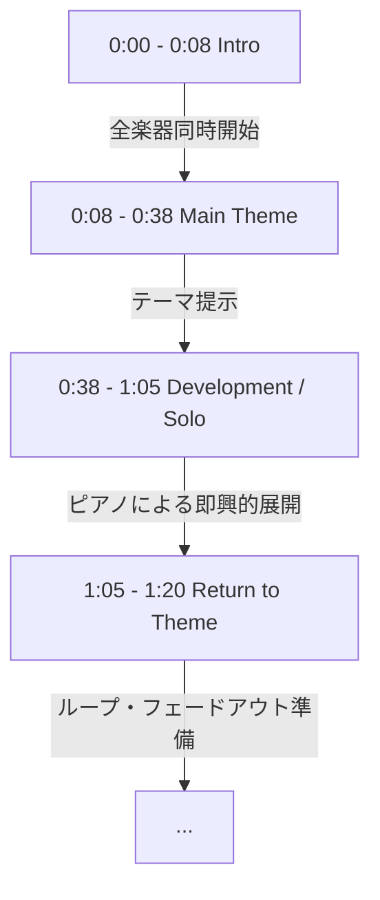

# Cafeシリーズ成功モデル001「cafe」詳細分析 Ver.2.0

## 目的
成功モデル001を「感覚」ではなく「再現可能な音楽データ」として保存し、今後のSUNO AIプロンプト設計の精度向上につなげる。

---

## 第1章：分析結果（事実）

### 1. 基本データ
- **推定BPM:** 115-120 BPM（安定したウォーキングテンポ）
- **曲の長さ:** 3分42秒
- **使用楽器:** Acoustic Piano, Upright Bass, Drums (Brushes)

### 2. キーとコード進行（推定）
- **推定Key:** **F Major**（またはBb Major）
  - 転調は確認されないが、セカンダリードミナント等による一時的な調性の揺らぎ（D minorやBb Majorへの引き込み）があり、ジャズ特有の洗練さを生んでいる。
- **代表的なコード進行:**
  - **Intro:** `ii - V - I - vi` (例: Gm7 - C7 - Fmaj7 - Dm7)
  - **Main Theme:** `ii - V - I - I` / `ii - V - iii - vi`
  - **Loop/Solo:** `ii - V - I` の循環（Vamp）

### 3. 楽器別の詳細分析
#### **Bass (Upright Bass)**
- **最初2秒:** ピアノ・ドラムと同時に開始。ウォーキングベースラインを展開。
- **役割:** 楽曲のハーモニックアンカー（土台）。
- **主張/支え:** 常に一定のリズムを刻み、楽曲の「重み」と「推進力」を支えている。
- **音域:** 低域（40Hz-100Hz）が支配的だが、中域（100Hz-800Hz）に弦のタッチ音が含まれ、スマホスピーカーでも輪郭がはっきりしている。

#### **Piano (Acoustic Piano)**
- **開始タイミング:** 0:00から即座に開始。
- **メロディ構成:** シンコペーションを多用した「問いと答え」のような会話的フレーズ。
- **繰り返しパターン:** A-B-A形式のキャッチーなモチーフ。
- **役割:** 主旋律の提示と、和音によるリズム（コンピング）の両方を担う。

### 4. 曲構造図（タイムライン）

---

## 第2章：推測・考察（仮説）

### 1. SNS適性（推測）
- **TikTokで使われやすい理由:** 
  - 冒頭0秒で「お洒落なカフェ」という世界観が完結しているため、動画の最初の数秒で視聴者の情緒をキャッチできる。
  - 特定の感情（悲しみや激しい喜び）を強制しないため、投稿者の日常動画に「馴染みやすい」。

### 2. 6.2億回視聴の要因（考察）
- **「隙間」の設計:** 
  - 音数が多すぎず、周波数が整理されているため、視聴者のデバイスから流れる「声」や「環境音」と喧嘩しない。
  - この「邪魔をしない」という特性が、世界中のクリエイターに「最も安全で質の高い選択肢」として選ばれ続けた要因と推測される。

### 3. BGMとしての優位性（考察）
- **周波数の安定:** 
  - 急激な音量変化や高域の鋭い音がないため、脳にストレスを与えず、長時間の作業やリラックスに適している。

---

## 第3章：彩花（CTO）への引き継ぎ・改善ポイント

### プロンプト設計への反映
- **Key指定:** `F Major` や `Bb Major` を指定し、明るく落ち着いた調性を維持する。
- **コード指定:** `Jazz turnaround ii-V-I-vi progression` をキーワードに含める。
- **Bass指示:** `Walking upright bassline with clear string definition` とし、輪郭を強調する。

### 進化のポイント（成功モデル001超え）
- 成功モデル001は「同時開始」だが、FieldRiseルールVer.1.1の**「0〜2秒のBass単独開始」**を適用することで、よりモダンで中毒性の高い導入部を作成できる。

---
**分析実施:** 桃花（COO）
**日付:** 2026年7月27日
**バージョン:** 2.0
