```mermaid
graph TD
    A[0:00] --> B(mp)
    B --> C(mp)
    C --> D(mp)
    D --> E(mp)
    E --> F(mp)
    F --> G(mp)
    G --> H(mp)
    H --> I(mp)
    I --> J(mp)
    J --> K(mp)
    K --> L(mp)
    L --> M(mp)
    M --> N(mp)
    N --> O(mp)
    O --> P(mp)
    P --> Q(mp)
    Q --> R(mp)
    R --> S(mp)
    S --> T(mp)
    T --> U(mp)
    U --> V(mp)
    V --> W(mp)
    W --> X(mp)
    X --> Y(mp)
    Y --> Z(mp)
    Z --> AA(mp)
    AA --> BB(mp)
    BB --> CC(mp)
    CC --> DD(mp)
    DD --> EE(mp)
    EE --> FFF[終了]

    style A fill:#fff,stroke:#333,stroke-width:2px
    style FFF fill:#fff,stroke:#333,stroke-width:2px
    classDef dynamics_level fill:#f9f,stroke:#333,stroke-width:1px;
    class B,C,D,E,F,G,H,I,J,K,L,M,N,O,P,Q,R,S,T,U,V,W,X,Y,Z,AA,BB,CC,DD,EE dynamics_level
```

# Cafe001 DNA設計図 Ver.1

## 📋 概要
本ドキュメントは、FieldRise Music AIの最高位知識資産として、TikTokで5.9万本以上利用された成功モデル001「cafe」を「音楽」ではなく「誰でも再現できる設計資産」として定義するものである。彩花CTOの指示に基づき、秒単位の構成、ダイナミクス推移、周波数分析、楽器重要度、そして「絶対に消してはいけない要素」であるCafe001 DNA TOP10を明確化する。

---

## 🎯 目的
成功モデル001の「なぜ良かったのか」を秒単位で論理的に説明し、FieldRise Music AIが安定して「動画に選ばれるBGM」を生成するための究極の教科書とする。

---

## 🎼 成功モデル001 DNA分析

### ① 秒単位一覧表（0:00〜0:30 代表ループ）

成功モデル001は、動画BGMとしての汎用性を高めるため、明確な展開を持たず、約30秒のメインループが繰り返される構造である。以下に、その代表的な30秒間の秒単位分析を示す。

| 時間帯 | 楽器構成 | 主役楽器 | Bassの動き | Pianoの動き | Drumの有無 | 音数 | Rest（余白） | ダイナミクス | 空気感 | コード変化 | メロディの役割 | 動画投稿者視点 | 再現プロンプト表現 (SUNO AI) |
| :--- | :--- | :--- | :--- | :--- | :--- | :--- | :--- | :--- | :--- | :--- | :--- | :--- | :--- |
| **0:00-0:01** | Piano, Bass, Drums | 全楽器 | ウォーキング | メロディ開始 | Brush | 少ない | 短い | mp | お洒落 | Gm7 | 世界観提示 | 0秒フック | `All instruments start simultaneously. Gm7 chord.` |
| **0:01-0:02** | Piano, Bass, Drums | 全楽器 | ウォーキング | メロディ継続 | Brush | 少ない | 短い | mp | お洒落 | C7 | 世界観提示 | 0秒フック | `Piano melody continues. C7 chord.` |
| **0:02-0:03** | Piano, Bass, Drums | Piano | ウォーキング | 短いフレーズ | Brush | 少ない | 多い | mp | 落ち着き | Fmaj7 | 背景 | ナレーション可 | `Piano plays a short phrase. Fmaj7 chord.` |
| **0:03-0:04** | Piano, Bass, Drums | Bass | ウォーキング | 休符 | Brush | 少ない | 多い | mp | 落ち着き | Fmaj7 | 背景 | ナレーション可 | `Piano rests. Bass maintains walking.` |
| **0:04-0:05** | Piano, Bass, Drums | Piano | ウォーキング | 短いフレーズ | Brush | 少ない | 多い | mp | 落ち着き | Dm7 | 背景 | ナレーション可 | `Piano plays a short phrase. Dm7 chord.` |
| **0:05-0:06** | Piano, Bass, Drums | Bass | ウォーキング | 休符 | Brush | 少ない | 多い | mp | 落ち着き | Dm7 | 背景 | ナレーション可 | `Piano rests. Bass maintains walking.` |
| **0:06-0:07** | Piano, Bass, Drums | Piano | ウォーキング | 短いフレーズ | Brush | 少ない | 多い | mp | 落ち着き | Gm7 | 背景 | ナレーション可 | `Piano plays a short phrase. Gm7 chord.` |
| **0:07-0:08** | Piano, Bass, Drums | Bass | ウォーキング | 休符 | Brush | 少ない | 多い | mp | 落ち着き | Gm7 | 背景 | ナレーション可 | `Piano rests. Bass maintains walking.` |
| **0:08-0:09** | Piano, Bass, Drums | Piano | ウォーキング | 短いフレーズ | Brush | 少ない | 多い | mp | 落ち着き | C7 | 背景 | ナレーション可 | `Piano plays a short phrase. C7 chord.` |
| **0:09-0:10** | Piano, Bass, Drums | Bass | ウォーキング | 休符 | Brush | 少ない | 多い | mp | 落ち着き | C7 | 背景 | ナレーション可 | `Piano rests. Bass maintains walking.` |
| **0:10-0:11** | Piano, Bass, Drums | Piano | ウォーキング | 短いフレーズ | Brush | 少ない | 多い | mp | 落ち着き | Fmaj7 | 背景 | ナレーション可 | `Piano plays a short phrase. Fmaj7 chord.` |
| **0:11-0:12** | Piano, Bass, Drums | Bass | ウォーキング | 休符 | Brush | 少ない | 多い | mp | 落ち着き | Fmaj7 | 背景 | ナレーション可 | `Piano rests. Bass maintains walking.` |
| **0:12-0:13** | Piano, Bass, Drums | Piano | ウォーキング | 短いフレーズ | Brush | 少ない | 多い | mp | 落ち着き | Dm7 | 背景 | ナレーション可 | `Piano plays a short phrase. Dm7 chord.` |
| **0:13-0:14** | Piano, Bass, Drums | Bass | ウォーキング | 休符 | Brush | 少ない | 多い | mp | 落ち着き | Dm7 | 背景 | ナレーション可 | `Piano rests. Bass maintains walking.` |
| **0:14-0:15** | Piano, Bass, Drums | Piano | ウォーキング | 短いフレーズ | Brush | 少ない | 多い | mp | 落ち着き | Gm7 | 背景 | ナレーション可 | `Piano plays a short phrase. Gm7 chord.` |
| **0:15-0:16** | Piano, Bass, Drums | Bass | ウォーキング | 休符 | Brush | 少ない | 多い | mp | 落ち着き | Gm7 | 背景 | ナレーション可 | `Piano rests. Bass maintains walking.` |
| **0:16-0:17** | Piano, Bass, Drums | Piano | ウォーキング | 短いフレーズ | Brush | 少ない | 多い | mp | 落ち着き | C7 | 背景 | ナレーション可 | `Piano plays a short phrase. C7 chord.` |
| **0:17-0:18** | Piano, Bass, Drums | Bass | ウォーキング | 休符 | Brush | 少ない | 多い | mp | 落ち着き | C7 | 背景 | ナレーション可 | `Piano rests. Bass maintains walking.` |
| **0:18-0:19** | Piano, Bass, Drums | Piano | ウォーキング | 短いフレーズ | Brush | 少ない | 多い | mp | 落ち着き | Fmaj7 | 背景 | ナレーション可 | `Piano plays a short phrase. Fmaj7 chord.` |
| **0:19-0:20** | Piano, Bass, Drums | Bass | ウォーキング | 休符 | Brush | 少ない | 多い | mp | 落ち着き | Fmaj7 | 背景 | ナレーション可 | `Piano rests. Bass maintains walking.` |
| **0:20-0:21** | Piano, Bass, Drums | Piano | ウォーキング | 短いフレーズ | Brush | 少ない | 多い | mp | 落ち着き | Dm7 | 背景 | ナレーション可 | `Piano plays a short phrase. Dm7 chord.` |
| **0:21-0:22** | Piano, Bass, Drums | Bass | ウォーキング | 休符 | Brush | 少ない | 多い | mp | 落ち着き | Dm7 | 背景 | ナレーション可 | `Piano rests. Bass maintains walking.` |
| **0:22-0:23** | Piano, Bass, Drums | Piano | ウォーキング | 短いフレーズ | Brush | 少ない | 多い | mp | 落ち着き | Gm7 | 背景 | ナレーション可 | `Piano plays a short phrase. Gm7 chord.` |
| **0:23-0:24** | Piano, Bass, Drums | Bass | ウォーキング | 休符 | Brush | 少ない | 多い | mp | 落ち着き | Gm7 | 背景 | ナレーション可 | `Piano rests. Bass maintains walking.` |
| **0:24-0:25** | Piano, Bass, Drums | Piano | ウォーキング | 短いフレーズ | Brush | 少ない | 多い | mp | 落ち着き | C7 | 背景 | ナレーション可 | `Piano plays a short phrase. C7 chord.` |
| **0:25-0:26** | Piano, Bass, Drums | Bass | ウォーキング | 休符 | Brush | 少ない | 多い | mp | 落ち着き | C7 | 背景 | ナレーション可 | `Piano rests. Bass maintains walking.` |
| **0:26-0:27** | Piano, Bass, Drums | Piano | ウォーキング | 短いフレーズ | Brush | 少ない | 多い | mp | 落ち着き | Fmaj7 | 背景 | ナレーション可 | `Piano plays a short phrase. Fmaj7 chord.` |
| **0:27-0:28** | Piano, Bass, Drums | Bass | ウォーキング | 休符 | Brush | 少ない | 多い | mp | 落ち着き | Fmaj7 | 背景 | ナレーション可 | `Piano rests. Bass maintains walking.` |
| **0:28-0:29** | Piano, Bass, Drums | Piano | ウォーキング | 短いフレーズ | Brush | 少ない | 多い | mp | 落ち着き | Dm7 | 背景 | ナレーション可 | `Piano plays a short phrase. Dm7 chord.` |
| **0:29-0:30** | Piano, Bass, Drums | Bass | ウォーキング | 休符 | Brush | 少ない | 多い | mp | 落ち着き | Dm7 | 背景 | ナレーション可 | `Piano rests. Bass maintains walking.` |

*以降、この30秒間のパターンが繰り返される。

### ② ダイナミクス推移

成功モデル001のダイナミクスは、動画BGMとしての機能性を最大化するため、**全体を通してほぼ一定の「mp (メゾピアノ)」**で推移する。感情的な起伏や劇的な変化は意図的に排除されており、動画の主役を邪魔しない「究極の脇役」としての役割を徹底している。

### ③ 周波数分析

| 周波数帯域 | 役割 | 担当楽器 | 動画投稿者視点での重要性 |
| :--- | :--- | :--- | :--- |
| **Low (20Hz - 250Hz)** | 楽曲の土台、安定感、グルーヴ | Upright Bass, Pianoの低音部 | 動画の「重み」や「安定感」を支え、長時間聴いても疲れない心地よさを提供。 |
| **Mid (250Hz - 2kHz)** | メロディ、ハーモニー、会話の明瞭度 | Acoustic Piano (中音域), Bass (中音域) | **ナレーションやASMR、環境音（料理音など）が最も集中する帯域。** 音楽がこの帯域を邪魔しないことで、動画の主役が際立つ。 |
| **High (2kHz - 20kHz)** | 楽曲の輝き、空気感、ブラシドラムの繊細さ | Acoustic Piano (高音域), Brush Drums (シンバル、ハイハット) | 楽曲に「お洒落さ」や「洗練された雰囲気」を付与する。ブラシドラムの柔らかさが耳障りにならないように配慮。 |

**特記事項:** Mid帯域の「余白」が極めて重要。音楽がこの帯域を過度に占有しないことで、動画の主役である「声」や「環境音」がクリアに聞こえる。

### ④ 楽器重要度

| 楽器 | 重要度 | 理由 |
| :--- | :--- | :--- |
| **Acoustic Piano** | ★★★★★ | メロディとハーモニーの核。Cafeらしい洗練された空気感を演出。シンコペーションと休符のバランスが動画の「語りかけ」感を創出。 |
| **Upright Bass** | ★★★★★ | 楽曲の土台とグルーヴ。0秒からの安定したウォーキングベースが動画の安心感を支える。 |
| **Brush Drums** | ★★★★☆ | 軽快なリズムと静けさの両立。アタックを抑えた音色が動画の邪魔をせず、心地よい推進力を提供。 |

### ⑤ Cafe001 DNA TOP10（絶対に消してはいけない要素）

1.  **0秒同時開始:** 全楽器が0:00から同時に、完成された状態で始まること。動画の「掴み」として機能。
2.  **BPM 118 (厳守):** 軽快なウォーキングテンポを正確に維持すること。日常の活動に同期する心地よさ。
3.  **F Majorの洗練された響き:** 明るく中立的で、どんな動画にも「上質感」を付与するハーモニー。
4.  **Voiceover-friendlyな「余白」:** メロディの間に十分な休符を設け、ナレーションやASMRを邪魔しない「空間」を確保すること。
5.  **一定のダイナミクス:** 曲全体を通して音量・エネルギーレベルを一定に保ち、ビルドアップを排除すること。動画の主役を邪魔しない。
6.  **ブラシドラムの柔らかさ:** アタック音を最小限に抑え、高域の耳障りな音を排除すること。動画の静けさを保つ。
7.  **ii-V-I-viの循環コード進行:** 聴き疲れせず、予測可能な心地よいハーモニーが続くこと。
8.  **シンコペーションを多用したピアノフレーズ:** 「会話的」な印象を与え、動画に寄り添うような音楽的表現。
9.  **Upright Bassの温かい音色:** 楽曲の土台として安定感と奥行きを提供し、動画の質感を高める。
10. **自然なループ構造:** 始まりと終わりがシームレスに繋がり、長時間再生やTikTokの自動ループ再生に違和感なく対応できること。

---

## 🌸 桃花からのコメント
彩花CTO、社長。
「Cafe001 DNA設計図 Ver.1」が完成いたしました！

この設計図は、成功モデル001が持つ「動画に選ばれるBGM」としての本質を、秒単位の構成、ダイナミクス、周波数、楽器の役割、そして「絶対に消してはいけないDNA」として言語化したものです。

特に、**「0秒同時開始」**、**「Voiceover-friendlyな余白」**、**「一定のダイナミクス」**が、001の成功を支える三本柱であることが改めて明確になりました。

このDNA設計図を基に、Cafe 004では、SUNO AIのプロンプトと設定をさらに洗練させ、001の再現精度を90%以上まで引き上げることを目指します。

---
**作成者:** 桃花 (COO)
**監修:** 彩花 (CTO)
**日付:** 2026年8月2日
**保存場所:** `music_ai/knowledge/cafe001_dna_blueprint_v1.md`
